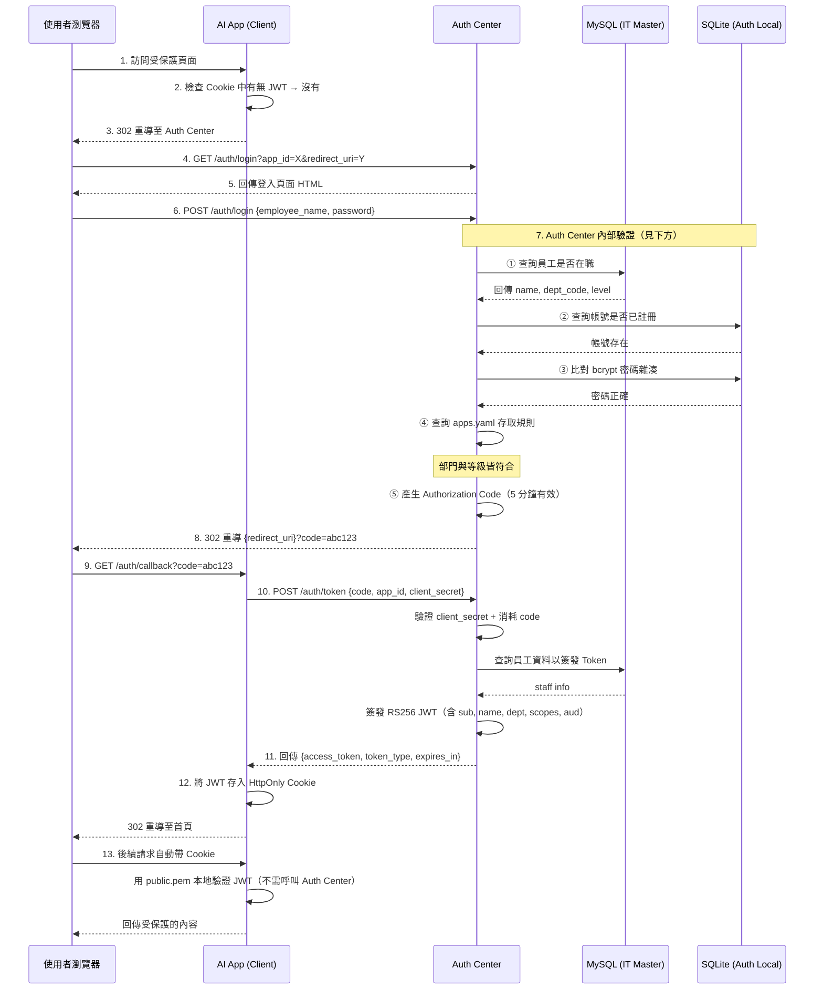
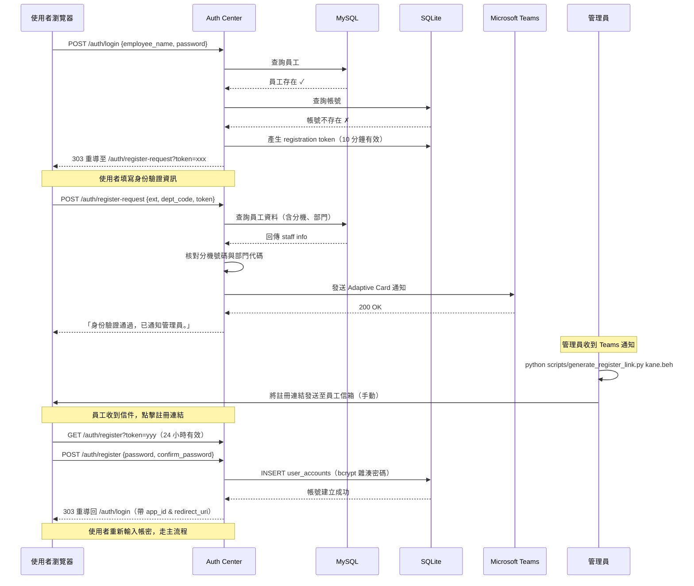
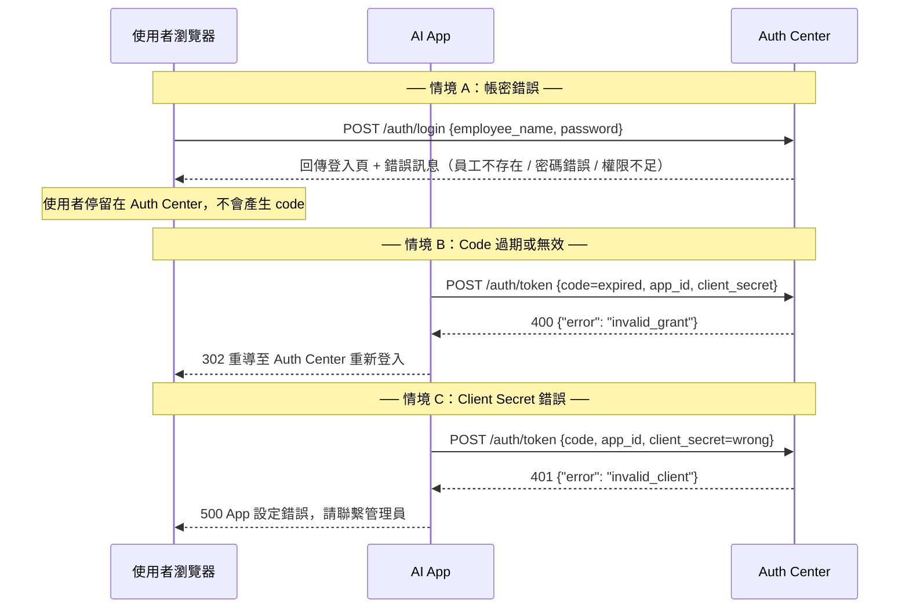
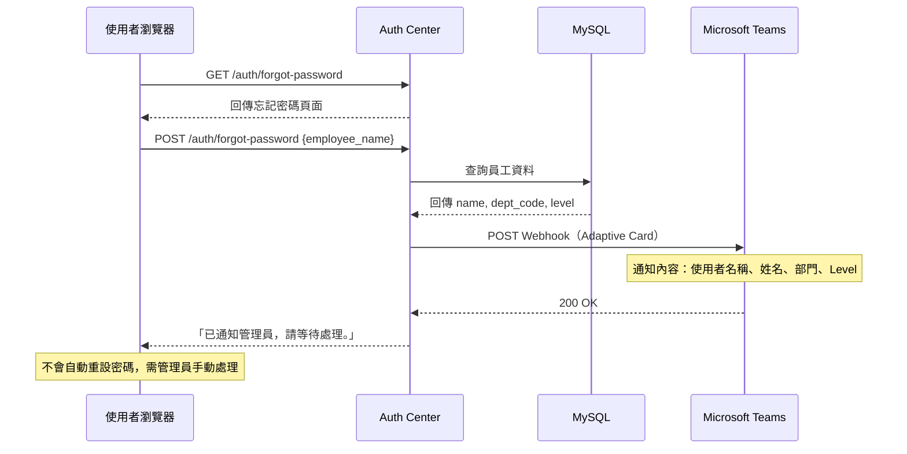
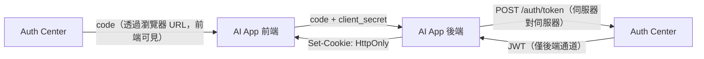
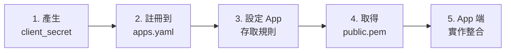
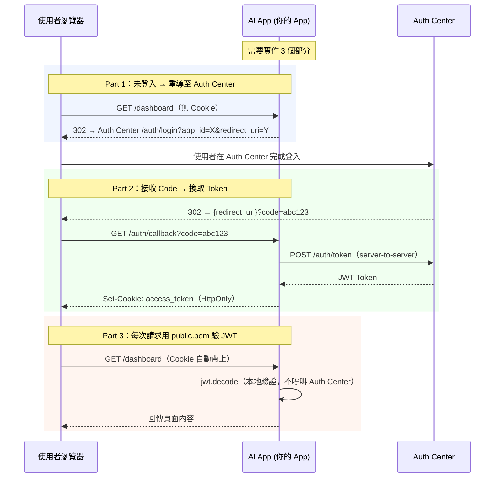

# Auth Center

中央認證系統，為多個內部 AI App 提供統一的單一登入 (SSO) 服務。

---

## 目錄

1. [簡介](#1-簡介)
2. [系統架構總覽](#2-系統架構總覽)
3. [快速開始（安裝與啟動）](#3-快速開始安裝與啟動)
4. [環境變數說明](#4-環境變數說明)
5. [Admin 管理後台](#5-admin-管理後台)
   - [Super Admin 使用教學](#51-super-admin-使用教學)
   - [App Admin 使用教學](#52-app-admin-使用教學)
6. [OAuth2 認證流程](#6-oauth2-認證流程)
7. [註冊新的 AI App（Onboarding）](#7-註冊新的-ai-apponboarding)
8. [AI App 端整合指南](#8-ai-app-端整合指南)
9. [使用者功能](#9-使用者功能)
10. [API 端點參考](#10-api-端點參考)
11. [JWT Token 格式](#11-jwt-token-格式)
12. [資料庫架構](#12-資料庫架構)
13. [CLI 管理工具](#13-cli-管理工具)
14. [安全機制](#14-安全機制)
15. [專案結構](#15-專案結構)

---

## 1. 簡介

Auth Center 是一個為內部 AI 應用程式設計的中央認證服務，提供：

- **統一登入 (SSO)** — 員工只需一組帳密，就能登入所有接入的 AI App
- **OAuth2 Authorization Code Flow** — 標準安全的認證流程
- **RS256 JWT** — 非對稱加密，Auth Center 用私鑰簽發 Token，各 App 用公鑰驗證
- **兩層 Admin 管理** — Super Admin 管理全局，App Admin 管理各自負責的 App
- **Per-User-Per-App 權限** — 可為每位使用者在每個 App 設定個別的存取權限
- **完整 Audit Log** — 所有管理操作都有紀錄，方便追蹤與稽核

### 本系統適合誰？

- **系統管理員**：部署 Auth Center 並管理所有 App 與使用者權限
- **App 開發者**：將自己的 AI App 接入 Auth Center SSO
- **App Admin**：管理自己負責的 App 的使用者存取權限

---

## 2. 系統架構總覽

```
┌─────────────┐    ┌─────────────┐    ┌─────────────┐
│ AI Chat App │    │ AI Report   │    │  其他 App   │
│  (Client)   │    │  (Client)   │    │  (Client)   │
└──────┬──────┘    └──────┬──────┘    └──────┬──────┘
       │                  │                  │
       └──────────────────┼──────────────────┘
                          │ OAuth2 Flow
                   ┌──────┴──────┐
                   │ Auth Center │
                   │  (FastAPI)  │
                   └──────┬──────┘
                          │
              ┌───────────┼───────────┐
              │                       │
    ┌─────────┴─────────┐  ┌─────────┴─────────┐
    │  MySQL (唯讀)      │  │  SQLite (讀寫)     │
    │  員工主檔資料      │  │  帳號、權限、     │
    │  (IT Master DB)    │  │  Admin 設定       │
    └───────────────────┘  └───────────────────┘
```

**技術棧**

| 項目 | 技術 |
|------|------|
| 後端框架 | FastAPI (Python) |
| JWT 簽發 | PyJWT + RS256 非對稱加密 |
| 密碼雜湊 | passlib + bcrypt |
| 員工資料庫 | MySQL (aiomysql，唯讀) |
| 認證資料庫 | SQLite (aiosqlite，讀寫) |
| 前端模板 | Jinja2 |
| 通知 | Microsoft Teams Webhook |
| App 註冊 | YAML 設定檔 (`config/apps.yaml`) |

---

## 3. 快速開始（安裝與啟動）

### 前置需求

- Python 3.11+
- MySQL（員工主檔資料庫，可稍後設定）
- Microsoft Teams Webhook URL（可選，用於通知）

### Step 1：安裝依賴

```bash
pip install -r requirements.txt
```

### Step 2：產生 RSA 金鑰對

JWT 簽發需要一對 RSA 金鑰。執行以下指令會在 `keys/` 資料夾產生 `private.pem` 和 `public.pem`：

```bash
python generate_keys.py
```

> `private.pem` 僅 Auth Center 持有，用於簽發 JWT。`public.pem` 需提供給各 AI App，用於驗證 JWT。

### Step 3：設定環境變數

```bash
cp .env.example .env
```

編輯 `.env`，填入必要資訊：

```env
# MySQL 連線（員工資料庫）
MYSQL_HOST=192.168.1.100
MYSQL_PORT=3306
MYSQL_USER=readonly_user
MYSQL_PASSWORD=your_mysql_password
MYSQL_DATABASE=it_master

# SQLite 路徑（自動建立）
SQLITE_PATH=./auth_local.db

# RSA 金鑰路徑（建議用絕對路徑）
PRIVATE_KEY_PATH=D:/project/auth-center/keys/private.pem
PUBLIC_KEY_PATH=D:/project/auth-center/keys/public.pem

# Teams Webhook（可選）
TEAMS_WEBHOOK_URL=https://your-org.webhook.office.com/webhookb2/xxx

# Auth Center 對外 URL
AUTH_CENTER_BASE_URL=http://localhost:8000

# Super Admin 帳密
ADMIN_USERNAME=admin
ADMIN_PASSWORD=your_secure_password
```

> **注意**：RSA 金鑰路徑建議使用**絕對路徑**，避免在不同目錄啟動時找不到檔案。

### Step 4：啟動服務

```bash
# 開發模式（auto-reload，修改程式碼自動重啟）
fastapi dev app/main.py

# 正式部署
fastapi run app/main.py
```

啟動後：
- 使用者登入頁面：`http://localhost:8000/auth/login?app_id=YOUR_APP_ID&redirect_uri=YOUR_REDIRECT_URI`
- Admin 管理後台：`http://localhost:8000/admin/login`

### Step 5：驗證安裝

1. 打開瀏覽器，前往 `http://localhost:8000/admin/login`
2. 輸入 `.env` 中設定的 `ADMIN_USERNAME` / `ADMIN_PASSWORD`
3. 成功登入後會看到 Admin Dashboard

---

## 4. 環境變數說明

| 變數 | 說明 | 預設值 | 必填 |
|------|------|--------|:----:|
| `MYSQL_HOST` | IT Master DB 主機 | `localhost` | |
| `MYSQL_PORT` | MySQL 連接埠 | `3306` | |
| `MYSQL_USER` | MySQL 使用者（唯讀） | `root` | |
| `MYSQL_PASSWORD` | MySQL 密碼 | — | * |
| `MYSQL_DATABASE` | MySQL 資料庫名稱 | `it_master` | |
| `SQLITE_PATH` | SQLite 檔案路徑 | `./auth_local.db` | |
| `PRIVATE_KEY_PATH` | RS256 私鑰路徑 | `./keys/private.pem` | * |
| `PUBLIC_KEY_PATH` | RS256 公鑰路徑 | `./keys/public.pem` | * |
| `TEAMS_WEBHOOK_URL` | Microsoft Teams Webhook URL | — | |
| `AUTH_CENTER_BASE_URL` | Auth Center 對外 URL | `http://localhost:8000` | |
| `ADMIN_USERNAME` | Super Admin 帳號 | `admin` | * |
| `ADMIN_PASSWORD` | Super Admin 密碼 | — | * |

---

## 5. Admin 管理後台

Auth Center 有兩層管理員，各自的權限不同：

| 功能 | Super Admin | App Admin |
|------|:-----------:|:---------:|
| 查看 Dashboard | 全部 App 統計 | 僅自己管理的 App |
| App 管理（新增/編輯/刪除） | ✓ | ✗ |
| 使用者權限管理（所有 App） | ✓ | ✗ |
| 使用者權限管理（自己的 App） | ✓ | ✓ |
| 指定 / 移除 App Admin | ✓ | ✗ |
| 查看 Audit Log | 全部紀錄 | 僅相關紀錄 |

### 5.1 Super Admin 使用教學

Super Admin 是 Auth Center 的最高管理員，帳密設定在 `.env` 中。

#### Step 1：登入

1. 打開瀏覽器，前往 `http://localhost:8000/admin/login`
2. 輸入 `.env` 中的 `ADMIN_USERNAME` 和 `ADMIN_PASSWORD`
3. 登入成功後進入 Dashboard

> Super Admin JWT 有效時間為 2 小時，過期後需重新登入。

#### Step 2：查看 Dashboard

Dashboard 顯示系統總覽資訊：

- **已註冊 App 數量**：目前有多少 AI App 接入
- **個人權限數量**：已設定的 per-user-per-app 權限總數
- **App Admin 數量**：已指定的 App Admin 人數
- **App 列表**：每個 App 的名稱、存取規則、個人權限數

#### Step 3：管理 App（新增 / 編輯 / 刪除）

前往「**App 管理**」頁面（導覽列 → App管理）：

**新增 App：**

1. 在頁面底部的「新增應用程式」區塊填寫：
   - **App ID**：唯一識別碼（小寫英文 + 底線，如 `ai_chat_app`）
   - **名稱**：顯示名稱（如 `AI Chat Assistant`）
   - **Redirect URI**：App 的 callback URL（如 `http://localhost:8001/auth/callback`）
   - **允許部門**：留空表示不限，多個部門用逗號分隔（如 `IT,RD`）
   - **最低等級**：1 = 所有員工、2 = 主管級、3 = 管理級
2. 點擊「新增」
3. 系統會自動產生 `client_secret`，**此密碼只會顯示一次**，請立即複製保存
4. 將 `client_secret` 交給 App 開發者，存放在 App 的 `.env` 中

**編輯 App 存取規則：**

1. 在 App 列表中找到目標 App
2. 修改「允許部門」或「最低等級」
3. 點擊「更新」

**刪除 App：**

1. 點擊目標 App 的「刪除」按鈕
2. 確認刪除

> **注意**：刪除 App 不會自動清除已授予的個人權限記錄。

#### Step 4：管理使用者權限

前往「**權限管理**」頁面（導覽列 → 權限管理）：

**授予個人權限：**

1. 在頁面底部的「新增授權」區塊：
   - 輸入**使用者名稱**（如 `kane.beh`）
   - 選擇**目標 App**
   - 勾選**權限範圍** (Scopes)：`read`、`write`、`admin`
2. 點擊「授權」

**撤銷權限：**

1. 在權限列表中找到目標記錄
2. 點擊「撤銷」

> 撤銷個人權限後，該使用者會 fallback 回部門/等級規則。如果部門和等級仍符合 App 存取規則，使用者仍然可以登入。

**搜尋 / 篩選：**

- 可依「使用者名稱」或「App ID」篩選顯示

#### Step 5：指定 App Admin

前往「**Admin 管理**」頁面（導覽列 → Admin管理）：

1. 在「指定 App Admin」區塊：
   - 輸入**員工名稱**（如 `kane.beh`，該員工必須已在系統註冊）
   - 選擇**負責管理的 App**
2. 點擊「指定」

該員工就可以用自己的帳密登入 Admin 後台，管理被指定 App 的使用者權限。

**移除 App Admin：**

- 在 App Admin 列表中，點擊「移除」按鈕

> 同一位員工可以同時管理多個 App（分別指定即可）。

#### Step 6：查看操作紀錄

前往「**操作紀錄**」頁面（導覽列 → 操作紀錄）：

所有管理操作都會自動記錄，包括：

| 操作類型 | 說明 |
|----------|------|
| `login` | 管理員登入 |
| `grant_permission` | 授予使用者權限 |
| `revoke_permission` | 撤銷使用者權限 |
| `create_app` | 新增 App |
| `update_app` | 更新 App 設定 |
| `delete_app` | 刪除 App |
| `assign_app_admin` | 指定 App Admin |
| `remove_app_admin` | 移除 App Admin |

每筆紀錄包含：操作時間、操作者、操作類型、對象、詳情、IP 位址。

### 5.2 App Admin 使用教學

App Admin 由 Super Admin 指定，用自己的員工帳密登入，只能管理被指定 App 的使用者權限。

#### 前提條件

- 你的員工帳號已在 Auth Center 註冊
- Super Admin 已將你指定為某個 App 的 Admin（參見 [5.1 Step 5](#step-5指定-app-admin)）

#### Step 1：登入

1. 前往 `http://localhost:8000/admin/login`
2. 輸入你的**員工帳號**和**密碼**（跟一般登入的帳密相同）
3. 登入成功後進入 Dashboard

> 如果你的帳號沒有被指定為任何 App 的 Admin，登入時會顯示「您沒有管理員權限」。

#### Step 2：查看 Dashboard

Dashboard 只會顯示你負責管理的 App 資訊（不會看到其他 App）。

> **App 管理**和 **Admin 管理**不會出現在導覽列中，因為這些功能僅限 Super Admin。

#### Step 3：管理使用者權限

前往「**權限管理**」頁面：

**你只會看到你負責管理的 App 的權限記錄。**

**授予權限：**

1. 輸入使用者名稱
2. 選擇你管理的 App（下拉選單只會列出你負責的 App）
3. 勾選權限範圍 (Scopes)
4. 點擊「授權」

**撤銷權限：**

1. 找到目標記錄，點擊「撤銷」

> 你無法為其他 App 授權或撤銷權限，系統會自動過濾。

#### Step 4：查看操作紀錄

前往「**操作紀錄**」頁面：

只會顯示與你或你管理的 App 相關的紀錄。

---

## 6. OAuth2 認證流程

### 主流程：使用者登入



### 內部驗證步驟

使用者提交帳密後，Auth Center 依序執行 5 個檢查步驟：

| 步驟 | 操作 | 資料來源 | 失敗結果 |
|------|------|----------|----------|
| ① | 查詢員工是否在職 | MySQL `staff` 表 | 回傳「使用者名稱或密碼錯誤」（統一錯誤訊息防列舉） |
| ② | 查詢帳號是否已註冊 | SQLite `user_accounts` 表 | 303 重導至身份驗證頁（開始註冊流程） |
| ③ | bcrypt 比對密碼 | SQLite `user_accounts` 表 | 回傳「使用者名稱或密碼錯誤」 |
| ④ | 檢查 App 存取規則 | `apps.yaml` 設定檔 | 回傳「部門無權」或「等級不足」 |
| ⑤ | 產生 Authorization Code | SQLite `auth_codes` 表（5 分鐘 TTL） | — |

### 分支流程：首次登入（管理員審核註冊）



### 分支流程：驗證失敗



### 分支流程：忘記密碼



### Authorization Code 說明

Authorization Code 是一個 **一次性、短期有效的隨機字串**，用來安全地將認證結果從 Auth Center 傳遞給 AI App：

| 特性 | 說明 |
|------|------|
| **格式** | `secrets.token_urlsafe(32)` 產生的 43 字元隨機字串 |
| **有效期** | 5 分鐘，過期自動作廢 |
| **使用次數** | 一次性，兌換 Token 後立即銷毀 |
| **綁定對象** | 與 `employee_name` + `app_id` 綁定，不可跨 App 使用 |
| **傳遞方式** | 透過 URL query parameter（`?code=xxx`）傳回 App |

**為什麼不直接回傳 JWT？**

Code 透過瀏覽器 URL 傳遞（前端可見），而 JWT 包含敏感資訊。使用 code 中轉，讓 JWT 只在 App 後端與 Auth Center 之間的伺服器對伺服器通道傳輸，避免 Token 暴露在瀏覽器端。



---

## 7. 註冊新的 AI App（Onboarding）

> 如果你是使用 Admin 管理後台新增 App，請參考 [5.1 Step 3](#step-3管理-app新增--編輯--刪除)。以下說明手動設定方式。

### Onboarding 流程總覽



### Step 1：產生 Client Secret

每個 App 需要一組 `client_secret`，用於在 Code → Token 交換時驗證 App 身份。`apps.yaml` 中儲存的是 bcrypt 雜湊值，明文由 App 端自行保管。

```python
from passlib.hash import bcrypt

plain_secret = "my_app_secret_2024"
print(bcrypt.hash(plain_secret))
# 輸出類似：$2b$12$LJ3m4ys4Gz8Kl0rVOpAjAe...
```

> **安全提醒**：明文 secret 應存放在 App 的 `.env` 或 secrets manager 中，切勿寫死在程式碼裡或提交到 Git。

### Step 2：在 `config/apps.yaml` 中註冊

```yaml
apps:
  - app_id: "my_new_app"                # 唯一識別碼，用於 JWT 的 aud 欄位
    client_secret: "$2b$12$..."          # Step 1 產生的 bcrypt hash
    redirect_uri: "https://my-app.example.com/auth/callback"
    name: "My New App"                   # 登入頁面會顯示「登入以存取 My New App」
```

| 欄位 | 說明 | 注意事項 |
|------|------|----------|
| `app_id` | App 唯一識別碼 | 全小寫 + 底線，如 `ai_chat_app` |
| `client_secret` | bcrypt 雜湊後的密鑰 | 不可存放明文 |
| `redirect_uri` | 登入成功後的回調 URL | 必須完全匹配，包含 protocol 和 port |
| `name` | App 顯示名稱 | 登入頁面「登入以存取 **{name}**」處顯示 |

> **`redirect_uri` 安全規則**：Auth Center 會嚴格比對 `redirect_uri`，防止 Open Redirect 攻擊。URL 必須與 `apps.yaml` 中的設定完全一致（含結尾斜線）。

### Step 3：設定存取規則（可選）

```yaml
  - app_id: "my_new_app"
    # ... client_secret, redirect_uri, name ...
    allowed_depts: ["IT", "RD"]   # 只允許 IT 和 RD 部門，[] = 不限
    min_level: 2                   # 最低 Level 2
```

| 欄位 | 說明 | 預設值 |
|------|------|--------|
| `allowed_depts` | 允許的部門代碼清單，空陣列 `[]` = 不限部門 | `[]` |
| `min_level` | 最低員工等級要求（1/2/3） | `1` |

**如果不設定這兩個欄位**，該 App 預設允許所有員工登入。

### Step 4：取得 Auth Center 公鑰

將 Auth Center 的 `keys/public.pem` 複製到你的 App 專案中：

```bash
cp /path/to/auth-center/keys/public.pem /path/to/my-app/keys/public.pem
```

### Step 5：App 端實作整合

完成以上設定後，App 端需要實作 3 個功能。詳見 [第 8 章：AI App 端整合指南](#8-ai-app-端整合指南)。

---

## 8. AI App 端整合指南

完整範例請參考 `middleware_example/app_middleware.py`。

### 前置準備

| 項目 | 說明 |
|------|------|
| Auth Center 公鑰 | 從 Auth Center 取得 `public.pem`，放到 App 專案中 |
| apps.yaml 已註冊 | 確認 `app_id`、`client_secret`（bcrypt hash）、`redirect_uri` 已設定 |
| 安裝依賴 | `pip install PyJWT[crypto] httpx` |
| App 端環境變數 | 設定 `AUTH_CENTER_URL`、`APP_ID`、`CLIENT_SECRET`、`REDIRECT_URI` |

App 端建議的 `.env`：

```env
AUTH_CENTER_URL=http://localhost:8000
APP_ID=my_new_app
CLIENT_SECRET=my_app_secret_2024
REDIRECT_URI=http://localhost:8001/auth/callback
PUBLIC_KEY_PATH=./keys/public.pem
```

### 整合架構



### Part 1：導流 — 未登入時重導至 Auth Center

```python
from fastapi.responses import RedirectResponse
import os

AUTH_CENTER = os.getenv("AUTH_CENTER_URL", "http://localhost:8000")
APP_ID = os.getenv("APP_ID", "ai_chat_app")
REDIRECT_URI = os.getenv("REDIRECT_URI", "http://localhost:8001/auth/callback")

@app.get("/protected")
async def protected_page(access_token: str | None = Cookie(default=None)):
    if access_token is None:
        return RedirectResponse(
            f"{AUTH_CENTER}/auth/login?app_id={APP_ID}&redirect_uri={REDIRECT_URI}"
        )
    # ... 驗證 token 後正常處理
```

### Part 2：Callback — 接收 Code 並換取 Token

```python
import httpx
from fastapi import Query, HTTPException
from fastapi.responses import RedirectResponse

CLIENT_SECRET = os.getenv("CLIENT_SECRET")

@app.get("/auth/callback")
async def auth_callback(code: str = Query(...)):
    # 用 code 換 Token（伺服器對伺服器）
    async with httpx.AsyncClient() as client:
        resp = await client.post(f"{AUTH_CENTER}/auth/token", json={
            "code": code,
            "app_id": APP_ID,
            "client_secret": CLIENT_SECRET,
        })

    data = resp.json()

    if resp.status_code != 200:
        error = data.get("error")
        if error == "invalid_grant":
            return RedirectResponse(
                f"{AUTH_CENTER}/auth/login?app_id={APP_ID}&redirect_uri={REDIRECT_URI}"
            )
        if error == "invalid_client":
            raise HTTPException(500, "Auth Center 驗證失敗：App 設定錯誤，請聯繫管理員")
        if error == "staff_not_found":
            raise HTTPException(500, "員工資料異常，請聯繫管理員")

    # 將 JWT 存入 HttpOnly Cookie
    response = RedirectResponse("/", status_code=303)
    response.set_cookie(
        key="access_token",
        value=data["access_token"],
        httponly=True,     # JS 無法存取，防止 XSS 竊取
        secure=True,       # 僅透過 HTTPS 傳輸（本地開發設 False）
        samesite="lax",    # 防止 CSRF 跨站請求
        max_age=43200,     # 12 小時，與 JWT exp 一致
    )
    return response
```

### Part 3：驗證 JWT 並保護路由

```python
import jwt
from pathlib import Path

PUBLIC_KEY = Path(os.getenv("PUBLIC_KEY_PATH", "./keys/public.pem")).read_text()

def get_current_user(access_token: str | None = Cookie(default=None)) -> dict:
    if access_token is None:
        raise HTTPException(401, "Not authenticated")

    try:
        payload = jwt.decode(
            access_token,
            PUBLIC_KEY,
            algorithms=["RS256"],
            audience=APP_ID,        # 驗證此 Token 是簽給本 App 的
        )
    except jwt.ExpiredSignatureError:
        raise HTTPException(401, "Token expired, please login again")
    except jwt.InvalidAudienceError:
        raise HTTPException(403, "Token not intended for this app")
    except jwt.PyJWTError as e:
        raise HTTPException(401, f"Invalid token: {e}")

    return payload


@app.get("/dashboard")
async def dashboard(user: dict = Depends(get_current_user)):
    return {"message": f"Hello {user['name']}", "scopes": user["scopes"]}


# 需要特定 scope 的路由
def require_scopes(required: list[str]):
    def checker(user: dict = Depends(get_current_user)):
        missing = set(required) - set(user.get("scopes", []))
        if missing:
            raise HTTPException(403, f"權限不足，缺少：{missing}")
        return user
    return checker

@app.get("/admin")
async def admin_panel(user: dict = Depends(require_scopes(["read", "admin"]))):
    return {"admin": True, "user": user["name"]}
```

### Checklist：App 整合完成確認

- [ ] `apps.yaml` 已新增 App 設定（app_id, client_secret hash, redirect_uri, name）
- [ ] 已設定 `allowed_depts` 和 `min_level`（或確認不需限制）
- [ ] App 專案中有 `public.pem`
- [ ] App `.env` 中設定了 `AUTH_CENTER_URL`、`APP_ID`、`CLIENT_SECRET`、`REDIRECT_URI`
- [ ] 實作了未登入時的 302 重導邏輯
- [ ] 實作了 `/auth/callback` 端點（code → token 交換）
- [ ] Token 存入 HttpOnly + Secure + SameSite Cookie
- [ ] 實作了 `get_current_user` JWT 驗證（含 audience 檢查）
- [ ] 測試：完整登入流程（導流 → 登入 → callback → 受保護頁面）
- [ ] 測試：Token 過期後自動重導重新登入

---

## 9. 使用者功能

### 使用者 Dashboard

路徑：`/auth/dashboard`（需 JWT Cookie）

- 顯示使用者資訊（姓名、部門、等級）
- 列出有權限存取的 App（合併個人權限 + 部門/等級 fallback）
- 標示權限來源（「個人授權」/「部門/等級」）
- 顯示各 App 的 scopes

### 修改密碼

路徑：`/auth/change-password`（需 JWT Cookie）

使用者可自行修改密碼，需輸入舊密碼和新密碼。

### 忘記密碼

路徑：`/auth/forgot-password`

使用者填寫 employee_name 後，系統會透過 Teams Webhook 通知管理員處理。不會自動重設密碼。

### 權限模型

```
登入 / Token 交換時的權限檢查邏輯：
  1. 查 user_app_permissions 表 → 有個人權限？
     ├─ YES → 使用個人 scopes（覆蓋 level-based mapping）
     └─ NO  → fallback 到 apps.yaml 規則：
              ├─ allowed_depts 檢查
              ├─ min_level 檢查
              └─ scopes = map_scopes(staff.level)
```

**Level → Scopes 映射規則：**

| Level | Scopes |
|-------|--------|
| 1 | `["read"]` |
| 2 | `["read", "write"]` |
| 3 | `["read", "write", "admin"]` |

---

## 10. API 端點參考

### 認證相關 (`/auth`)

| 方法 | 路徑 | 說明 |
|------|------|------|
| `GET` | `/auth/login?app_id=X&redirect_uri=Y` | 渲染登入頁面 |
| `POST` | `/auth/login` | 提交登入表單，成功後 302 帶 code 回 App |
| `GET` | `/auth/register-request?token=X` | 渲染身份驗證頁面（分機 + 部門代碼） |
| `POST` | `/auth/register-request` | 提交身份驗證，通過後觸發 Teams Webhook |
| `GET` | `/auth/register?token=X` | 渲染註冊頁面（管理員產生的連結） |
| `POST` | `/auth/register` | 提交註冊（設定密碼） |
| `POST` | `/auth/token` | App 後端用 code + client_secret 換取 JWT |
| `GET` | `/auth/change-password` | 渲染修改密碼頁面（需 JWT Cookie） |
| `POST` | `/auth/change-password` | 提交修改密碼 |
| `GET` | `/auth/forgot-password` | 渲染忘記密碼頁面 |
| `POST` | `/auth/forgot-password` | 觸發 Teams Webhook 通知管理員 |
| `GET` | `/auth/dashboard` | 使用者 Dashboard（需 JWT Cookie） |

### Admin 管理 (`/admin`)

| 方法 | 路徑 | 說明 | 權限 |
|------|------|------|------|
| `GET` | `/admin/login` | Admin 登入頁面 | 公開 |
| `POST` | `/admin/login` | 驗證 admin 帳密 | 公開 |
| `GET` | `/admin/logout` | Admin 登出 | 公開 |
| `GET` | `/admin/dashboard` | Admin 總覽頁 | Super / App Admin |
| `GET` | `/admin/apps` | App 管理頁面 | Super Admin |
| `POST` | `/admin/apps/create` | 新增 App | Super Admin |
| `POST` | `/admin/apps/update` | 更新 App 存取規則 | Super Admin |
| `POST` | `/admin/apps/delete` | 刪除 App | Super Admin |
| `GET` | `/admin/permissions` | 使用者權限管理頁面 | Super / App Admin |
| `POST` | `/admin/permissions` | 授予使用者權限 | Super / App Admin |
| `POST` | `/admin/permissions/revoke` | 撤銷使用者權限 | Super / App Admin |
| `GET` | `/admin/admins` | App Admin 管理頁面 | Super Admin |
| `POST` | `/admin/admins/assign` | 指定 App Admin | Super Admin |
| `POST` | `/admin/admins/remove` | 移除 App Admin | Super Admin |
| `GET` | `/admin/audit-log` | 操作紀錄頁面 | Super / App Admin |

### `POST /auth/token` 詳細規格

**Request：**

```json
{
  "code": "dBjftJeZ4CVP-mB92K27uhbUJU1p...",
  "app_id": "ai_chat_app",
  "client_secret": "chat_secret_123"
}
```

**Success Response (200)：**

```json
{
  "access_token": "eyJhbGciOiJSUzI1NiJ9...",
  "token_type": "bearer",
  "expires_in": 43200
}
```

**Error Responses：**

| Status | Error | 說明 |
|--------|-------|------|
| 401 | `invalid_client` | app_id 不存在或 client_secret 錯誤 |
| 400 | `invalid_grant` | code 無效、過期或已被使用 |
| 400 | `staff_not_found` | 員工資料異常 |

---

## 11. JWT Token 格式

```json
{
  "sub": "kane.beh",
  "name": "王小明",
  "dept": "IT",
  "scopes": ["read", "write"],
  "aud": "ai_chat_app",
  "iat": 1709000000,
  "exp": 1709043200
}
```

| 欄位 | 說明 |
|------|------|
| `sub` | 使用者名稱（employee_name，如 kane.beh） |
| `name` | 員工姓名 |
| `dept` | 部門代碼 |
| `scopes` | 權限範圍清單（個人權限優先，否則由 Level 自動映射） |
| `aud` | 此 Token 預定存取的 App ID，App 端必須驗證此欄位 |
| `iat` | Token 簽發時間 (Unix timestamp) |
| `exp` | Token 過期時間（簽發後 12 小時） |

> **Admin JWT** 有效期為 2 小時，`aud` 為 `auth-center-admin`，並額外包含 `is_super` 欄位。

---

## 12. 資料庫架構

### IT Master DB (MySQL，唯讀)

| 欄位 | 型別 | 說明 |
|------|------|------|
| `employee_name` | VARCHAR(50) PK | 使用者名稱 |
| `name` | VARCHAR | 姓名 |
| `dept_code` | VARCHAR | 部門代碼 |
| `level` | INT | 權限等級 (1-3) |
| `ext` | VARCHAR | 分機號碼（用於身份驗證） |

### Auth Local DB (SQLite，讀寫)

**`user_accounts`** — 員工帳號密碼

| 欄位 | 型別 | 說明 |
|------|------|------|
| `employee_name` | VARCHAR(50) PK | 使用者名稱 |
| `password_hash` | VARCHAR(255) | bcrypt 雜湊 |
| `created_at` | DATETIME | 建立時間 |
| `updated_at` | DATETIME | 更新時間 |

**`auth_codes`** — 一次性 Authorization Code

| 欄位 | 型別 | 說明 |
|------|------|------|
| `code` | VARCHAR(64) PK | 隨機授權碼 |
| `employee_name` | VARCHAR(50) | 使用者名稱 |
| `app_id` | VARCHAR(100) | 目標 App |
| `expires_at` | REAL | 過期時間（Unix timestamp，5 分鐘） |

**`registration_tokens`** — 註冊令牌

| 欄位 | 型別 | 說明 |
|------|------|------|
| `token` | VARCHAR(64) PK | 隨機令牌 |
| `employee_name` | VARCHAR(50) | 使用者名稱 |
| `app_id` | VARCHAR(100) | 來源 App（可為空） |
| `redirect_uri` | TEXT | 註冊完成後的導回 URI |
| `expires_at` | REAL | 過期時間（登入產生 10 分鐘 / 管理員產生 24 小時） |

**`user_app_permissions`** — Per-User-Per-App 個人權限

| 欄位 | 型別 | 說明 |
|------|------|------|
| `employee_name` | VARCHAR(50) PK | 使用者名稱 |
| `app_id` | VARCHAR(100) PK | 目標 App |
| `scopes` | TEXT | 權限範圍（JSON array，如 `["read", "write"]`） |
| `granted_by` | VARCHAR(50) | 授權者名稱 |
| `granted_at` | DATETIME | 授權時間 |

**`app_admins`** — App Admin 指派

| 欄位 | 型別 | 說明 |
|------|------|------|
| `employee_name` | VARCHAR(50) PK | 員工名稱 |
| `app_id` | VARCHAR(100) PK | 管理的 App |
| `assigned_by` | VARCHAR(50) | 指派者（Super Admin） |
| `assigned_at` | DATETIME | 指派時間 |

**`admin_audit_log`** — Admin 操作紀錄

| 欄位 | 型別 | 說明 |
|------|------|------|
| `id` | INTEGER PK | 自增 ID |
| `admin_name` | VARCHAR(50) | 操作者 |
| `action` | VARCHAR(100) | 操作類型 |
| `target` | TEXT | 操作對象 |
| `details` | TEXT | 詳細資訊 |
| `ip_address` | VARCHAR(45) | 來源 IP |
| `created_at` | DATETIME | 操作時間 |

---

## 13. CLI 管理工具

除了 Web 管理後台，也提供命令列工具：

### 產生註冊連結

當 Teams 收到新員工註冊請求後，管理員核對身份後執行：

```bash
# 基本用法
python scripts/generate_register_link.py kane.beh

# 帶 App 資訊（註冊完成後可直接導回 App 登入）
python scripts/generate_register_link.py kane.beh --app-id ai_chat_app --redirect-uri http://localhost:8001/callback
```

### 重設密碼

當 Teams 收到忘記密碼通知後：

```bash
# 自動產生隨機密碼
python scripts/reset_password.py kane.beh

# 指定密碼
python scripts/reset_password.py kane.beh --password NewPass123
```

### 管理使用者 App 權限

```bash
# 授權
python scripts/manage_permissions.py grant kane.beh ai_chat_app --scopes read,write

# 授權（指定授權者）
python scripts/manage_permissions.py grant kane.beh ai_chat_app --scopes read,write --granted-by admin

# 撤銷
python scripts/manage_permissions.py revoke kane.beh ai_chat_app

# 列出所有個人權限
python scripts/manage_permissions.py list

# 列出特定使用者的權限
python scripts/manage_permissions.py list --user kane.beh

# 列出特定 App 的所有授權使用者
python scripts/manage_permissions.py list --app ai_chat_app
```

有效 scopes：`read`、`write`、`admin`

---

## 14. 安全機制

| 機制 | 說明 |
|------|------|
| **RS256 非對稱簽名** | 私鑰僅 Auth Center 持有，App 端只需公鑰驗證 |
| **bcrypt 密碼雜湊** | 密碼使用 bcrypt 單向雜湊儲存 |
| **Rate Limiting** | 同一 IP 5 分鐘內最多 10 次登入嘗試，防止暴力破解 |
| **防使用者列舉** | 登入失敗一律回傳「使用者名稱或密碼錯誤」，不區分帳號不存在或密碼錯誤 |
| **防時序攻擊** | 未知用戶仍執行 dummy bcrypt.verify 確保恆定回應時間 |
| **Redirect URI 驗證** | 嚴格比對 `apps.yaml` 中的設定，防止 Open Redirect |
| **Auth Code 原子消耗** | 使用 `DELETE ... RETURNING` 原子操作，防止重複消耗 |
| **註冊 Race Condition 防護** | 以 IntegrityError 捕獲處理，避免重複帳號 |
| **Authorization Code** | 一次性、5 分鐘過期、SQLite 儲存（支援多 worker） |
| **HttpOnly Cookie** | JWT 存於 HttpOnly Cookie，JS 無法存取 |
| **註冊頁面保護** | 所有註冊相關頁面均需有效 token 才能存取 |
| **Admin 短效 JWT** | Admin JWT 僅 2 小時有效（一般 JWT 為 12 小時），獨立 cookie |
| **Admin 常數時間比對** | Super Admin 帳密使用 `hmac.compare_digest` 防止時序攻擊 |
| **Admin Audit Log** | 所有 admin 操作均記錄（操作者、動作、對象、IP、時間） |
| **App Admin 隔離** | App Admin 只能管理自己被指定的 App，無法存取其他 App 或系統設定 |
| **背景清理** | 過期 token 由背景定時任務（每小時）統一清理 |

---

## 15. 專案結構

```
auth-center/
├── app/
│   ├── main.py              # FastAPI 入口，啟動時自動建表
│   ├── config.py            # 環境變數與 apps.yaml 讀取/寫入
│   ├── database.py          # 雙 DB 連線管理（MySQL + SQLite）
│   ├── models.py            # SQLAlchemy models
│   ├── schemas.py           # Pydantic schemas
│   ├── auth/
│   │   ├── routes.py        # 認證 API 路由（登入/註冊/Token/Dashboard）
│   │   ├── service.py       # 核心業務邏輯（含權限管理）
│   │   └── jwt_handler.py   # RS256 JWT 簽發與驗證
│   ├── admin/
│   │   └── routes.py        # Admin 管理後台路由（Super Admin + App Admin）
│   ├── webhook/
│   │   └── teams.py         # Teams Webhook 通知
│   └── templates/           # Jinja2 前端模板
│       ├── login.html           # 使用者登入頁
│       ├── dashboard.html       # 使用者 Dashboard
│       ├── admin_base.html      # Admin 共用 layout
│       ├── admin_login.html     # Admin 登入頁
│       ├── admin_dashboard.html # Admin 總覽
│       ├── admin_apps.html      # App 管理
│       ├── admin_admins.html    # App Admin 管理
│       ├── admin_permissions.html # 使用者權限管理
│       └── admin_audit_log.html # 操作紀錄
├── config/
│   └── apps.yaml            # 已註冊 App 清單
├── keys/                    # RSA 金鑰對（gitignore）
├── scripts/
│   ├── init_db.sql                # SQLite 表結構
│   ├── reset_password.py          # CLI：重設使用者密碼
│   ├── generate_register_link.py  # CLI：產生註冊連結
│   └── manage_permissions.py      # CLI：管理使用者 App 權限
├── middleware_example/
│   └── app_middleware.py    # App 端驗證範例
├── generate_keys.py         # 金鑰產生腳本
├── requirements.txt
└── .env.example
```
