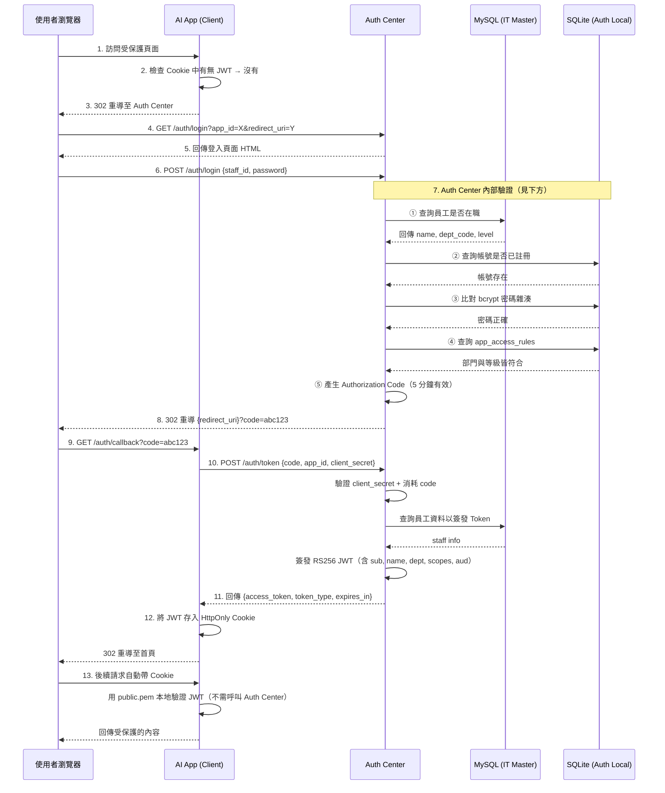
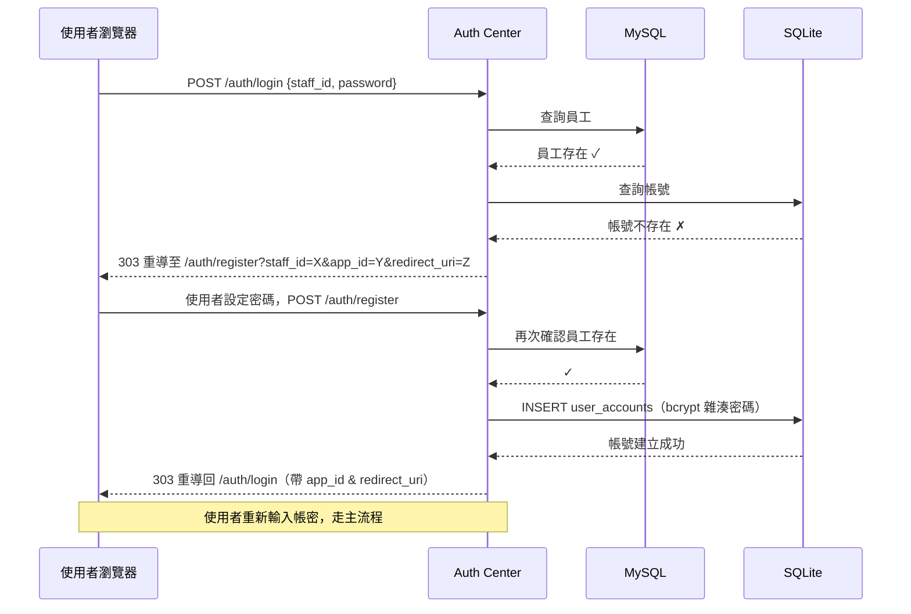
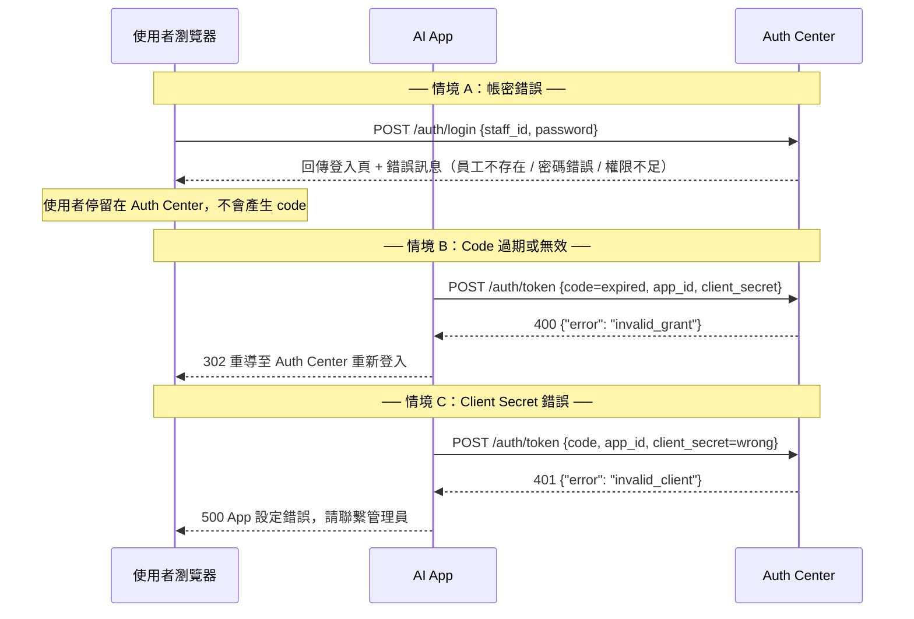
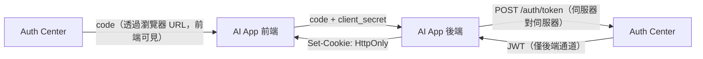
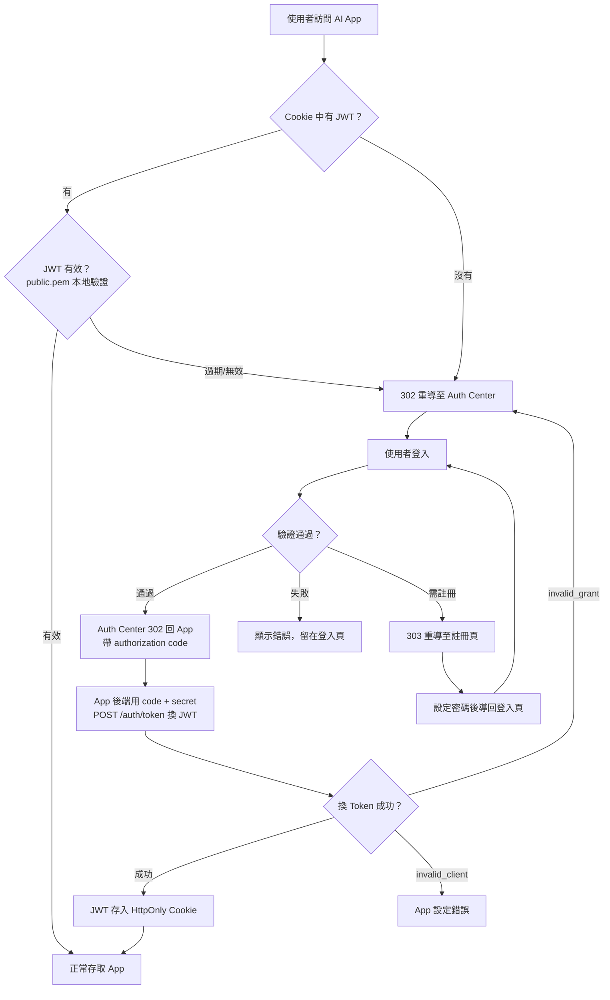

# Auth Center

中央認證系統，為多個內部 AI App 提供統一的單一登入 (SSO) 服務。

## 功能特色

- **OAuth2 Authorization Code Flow** — App 重導登入、code 換 token 標準流程
- **RS256 JWT** — 非對稱加密，Auth Center 簽發、各 App 用公鑰驗證
- **雙資料庫架構** — MySQL（員工主檔，唯讀）+ SQLite（帳號與權限，讀寫）
- **自動註冊** — 員工首次登入自動引導設定密碼
- **權限分級** — Level 1/2/3 自動映射為 `read` / `read+write` / `read+write+admin` scopes
- **App 存取控制** — 依部門與等級限制 App 存取權限
- **忘記密碼** — 透過 Microsoft Teams Webhook 通知管理員處理
- **Jinja2 UI** — 內建登入、註冊、忘記密碼頁面

## 專案結構

```
auth-center/
├── app/
│   ├── main.py              # FastAPI 入口
│   ├── config.py            # 環境變數與 apps.yaml 讀取
│   ├── database.py          # 雙 DB 連線管理
│   ├── models.py            # SQLAlchemy models
│   ├── schemas.py           # Pydantic schemas
│   ├── auth/
│   │   ├── routes.py        # API 路由
│   │   ├── service.py       # 核心業務邏輯
│   │   └── jwt_handler.py   # RS256 JWT 簽發與驗證
│   ├── webhook/
│   │   └── teams.py         # Teams Webhook 通知
│   └── templates/           # Jinja2 前端模板
├── config/
│   └── apps.yaml            # 已註冊 App 清單
├── keys/                    # RSA 金鑰對（gitignore）
├── scripts/
│   └── init_db.sql          # SQLite 表結構
├── middleware_example/
│   └── app_middleware.py    # App 端驗證範例
├── generate_keys.py         # 金鑰產生腳本
├── requirements.txt
└── .env.example
```

## 快速開始

```bash
# 安裝依賴
pip install -r requirements.txt

# 產生 RSA 金鑰對
python generate_keys.py

# 設定環境變數
cp .env.example .env
# 編輯 .env 填入 MySQL 連線資訊與 Teams Webhook URL

# 啟動服務（開發模式，auto-reload）
fastapi dev app/main.py

# 啟動服務（正式部署）
fastapi run app/main.py
```

## 環境變數

| 變數 | 說明 | 預設值 |
|------|------|--------|
| `MYSQL_HOST` | IT Master DB 主機 | `localhost` |
| `MYSQL_PORT` | MySQL 連接埠 | `3306` |
| `MYSQL_USER` | MySQL 使用者（唯讀） | `root` |
| `MYSQL_PASSWORD` | MySQL 密碼 | — |
| `MYSQL_DATABASE` | MySQL 資料庫名稱 | `it_master` |
| `SQLITE_PATH` | SQLite 檔案路徑 | `./auth_local.db` |
| `PRIVATE_KEY_PATH` | RS256 私鑰路徑 | `./keys/private.pem` |
| `PUBLIC_KEY_PATH` | RS256 公鑰路徑 | `./keys/public.pem` |
| `TEAMS_WEBHOOK_URL` | Microsoft Teams Webhook URL | — |
| `AUTH_CENTER_BASE_URL` | Auth Center 對外 URL | `http://localhost:8000` |

## OAuth2 認證流程（完整說明）

本系統採用類 **OAuth2 Authorization Code Flow**，完整流程如下：

### 主流程：登入成功



### 分支流程：首次登入（自動註冊）



### 分支流程：驗證失敗



### 分支流程：忘記密碼


### Auth Center 內部驗證細節

使用者提交帳密後，Auth Center 依序執行 5 個檢查步驟：

| 步驟 | 操作 | 資料來源 | 失敗結果 |
|------|------|----------|----------|
| ① | 查詢員工是否在職 | MySQL `staff` 表 | 回傳「員工編號不存在，請確認後重試。」 |
| ② | 查詢帳號是否已註冊 | SQLite `user_accounts` 表 | 303 重導至 `/auth/register`（自動註冊） |
| ③ | bcrypt 比對密碼 | SQLite `user_accounts` 表 | 回傳「密碼錯誤，請重新輸入。」 |
| ④ | 檢查 App 存取規則 | SQLite `app_access_rules` 表 | 回傳「部門無權」或「等級不足」 |
| ⑤ | 產生 Authorization Code | 記憶體（5 分鐘 TTL） | — |

所有驗證失敗都**不會產生 code**，使用者停留在 Auth Center 頁面直到通過驗證或放棄。

### Authorization Code 是什麼？

Authorization Code 是一個 **一次性、短期有效的隨機字串**（如 `dBjftJeZ4CVP-mB92K27uhbUJU1p...`），用來安全地將認證結果從 Auth Center 傳遞給 AI App：

| 特性 | 說明 |
|------|------|
| **格式** | `secrets.token_urlsafe(32)` 產生的 43 字元隨機字串 |
| **有效期** | 5 分鐘，過期自動作廢 |
| **使用次數** | 一次性，兌換 Token 後立即銷毀 |
| **綁定對象** | 與 `staff_id` + `app_id` 綁定，不可跨 App 使用 |
| **傳遞方式** | 透過 URL query parameter（`?code=xxx`）傳回 App |

**為什麼不直接回傳 JWT？**
Code 透過瀏覽器 URL 傳遞（前端可見），而 JWT 包含敏感資訊。使用 code 中轉，讓 JWT 只在 App 後端與 Auth Center 之間的伺服器對伺服器通道傳輸，避免 Token 暴露在瀏覽器端。



## API 端點

| 方法 | 路徑 | 說明 |
|------|------|------|
| `GET` | `/auth/login?app_id=X&redirect_uri=Y` | 渲染登入頁面 |
| `POST` | `/auth/login` | 提交登入表單，成功後 302 帶 code 回 App |
| `GET` | `/auth/register?staff_id=X&app_id=Y&redirect_uri=Z` | 渲染註冊頁面（首次登入設定密碼） |
| `POST` | `/auth/register` | 提交註冊，完成後導回登入頁 |
| `POST` | `/auth/token` | App 後端用 code + client_secret 換取 JWT |
| `GET` | `/auth/forgot-password` | 渲染忘記密碼頁面 |
| `POST` | `/auth/forgot-password` | 觸發 Teams Webhook 通知管理員 |

### `POST /auth/token` 詳細規格

**Request：**

```json
{
  "code": "dBjftJeZ4CVP-mB92K27uhbUJU1p...",
  "app_id": "ai_chat_app",
  "client_secret": "chat_secret_123"
}
```

**Success Response (200)：**

```json
{
  "access_token": "eyJhbGciOiJSUzI1NiJ9...",
  "token_type": "bearer",
  "expires_in": 43200
}
```

**Error Responses：**

```json
// 401 - App 身分驗證失敗（app_id 不存在或 client_secret 錯誤）
{ "error": "invalid_client" }

// 400 - Code 無效、過期或已被使用
{ "error": "invalid_grant" }

// 400 - 員工資料異常
{ "error": "staff_not_found" }
```

## JWT Token 格式

```json
{
  "sub": "EMP001",
  "name": "王小明",
  "dept": "IT",
  "scopes": ["read", "write"],
  "aud": "ai_chat_app",
  "iat": 1709000000,
  "exp": 1709043200
}
```

| 欄位 | 說明 |
|------|------|
| `sub` | 員工編號（來自 MySQL staff_id） |
| `name` | 員工姓名 |
| `dept` | 部門代碼 |
| `scopes` | 權限範圍清單，由員工等級自動映射 |
| `aud` | 此 Token 預定存取的 App ID，App 端必須驗證此欄位 |
| `iat` | Token 簽發時間 (Unix timestamp) |
| `exp` | Token 過期時間（簽發後 12 小時） |

**權限映射規則：**

| Level | Scopes |
|-------|--------|
| 1 | `["read"]` |
| 2 | `["read", "write"]` |
| 3 | `["read", "write", "admin"]` |

## 註冊新的 AI App

編輯 `config/apps.yaml`：

```yaml
apps:
  - app_id: "my_new_app"
    client_secret: "$2b$12$..."   # bcrypt hash of your secret
    redirect_uri: "https://my-app.example.com/auth/callback"
    name: "My New App"
```

產生 bcrypt hash：

```python
from passlib.hash import bcrypt
print(bcrypt.hash("your_plain_secret"))
```

## AI App 端整合指南

完整範例請參考 `middleware_example/app_middleware.py`。

### 前置準備

1. 從 Auth Center 取得 `public.pem`（RS256 公鑰，只能驗證不能簽發）
2. 在 Auth Center 的 `config/apps.yaml` 中註冊你的 App
3. 安裝依賴：`pip install PyJWT[crypto]`

### Step 1：未登入時重導至 Auth Center

當使用者訪問 App 的受保護頁面，但 Cookie 中沒有有效 JWT 時：

```python
from fastapi.responses import RedirectResponse

AUTH_CENTER = "http://localhost:8000"
APP_ID = "ai_chat_app"
REDIRECT_URI = "http://localhost:8001/auth/callback"

@app.get("/protected")
async def protected_page(access_token: str | None = Cookie(default=None)):
    if access_token is None:
        # 重導至 Auth Center 登入
        return RedirectResponse(
            f"{AUTH_CENTER}/auth/login?app_id={APP_ID}&redirect_uri={REDIRECT_URI}"
        )
    # ... 驗證 token 後正常處理
```

### Step 2：實作 Callback 端點接收 Code

Auth Center 登入成功後，會將使用者重導回你註冊的 `redirect_uri`，URL 中帶有 `code` 參數：

```
GET http://localhost:8001/auth/callback?code=dBjftJeZ4CVP-mB92K27uhbUJU1p...
```

App 後端需要用這個 code 向 Auth Center 換取 JWT：

```python
import httpx
from fastapi import Query
from fastapi.responses import RedirectResponse

CLIENT_SECRET = "chat_secret_123"  # 你的 App 明文 secret

@app.get("/auth/callback")
async def auth_callback(code: str = Query(...)):
    """用 authorization code 向 Auth Center 換取 JWT Token。"""

    # 伺服器對伺服器呼叫，code 和 secret 不會暴露在瀏覽器端
    async with httpx.AsyncClient() as client:
        resp = await client.post(f"{AUTH_CENTER}/auth/token", json={
            "code": code,
            "app_id": APP_ID,
            "client_secret": CLIENT_SECRET,
        })

    data = resp.json()

    # 處理錯誤
    if resp.status_code != 200:
        if data.get("error") == "invalid_grant":
            # Code 過期或已使用，引導重新登入
            return RedirectResponse(
                f"{AUTH_CENTER}/auth/login?app_id={APP_ID}&redirect_uri={REDIRECT_URI}"
            )
        if data.get("error") == "invalid_client":
            raise HTTPException(500, "App 設定錯誤，請聯繫管理員")

    # 將 JWT 存入 HttpOnly Cookie（瀏覽器端 JS 無法讀取，防止 XSS）
    response = RedirectResponse("/", status_code=303)
    response.set_cookie(
        key="access_token",
        value=data["access_token"],
        httponly=True,     # JS 無法存取
        secure=True,       # 僅透過 HTTPS 傳輸（本地開發設 False）
        samesite="lax",    # 防止 CSRF
        max_age=43200,     # 12 小時，與 JWT exp 一致
    )
    return response
```

### Step 3：驗證 JWT 並保護路由

後續每個請求，瀏覽器會自動帶上 Cookie。App 使用 `public.pem` 在本地驗證 JWT，**不需要再呼叫 Auth Center**：

```python
import jwt
from pathlib import Path

PUBLIC_KEY = Path("./keys/public.pem").read_text()

def get_current_user(access_token: str | None = Cookie(default=None)) -> dict:
    """從 Cookie 取出 JWT 並驗證。"""
    if access_token is None:
        raise HTTPException(401, "Not authenticated")

    try:
        payload = jwt.decode(
            access_token,
            PUBLIC_KEY,
            algorithms=["RS256"],
            audience=APP_ID,        # 驗證此 Token 是簽給本 App 的
        )
    except jwt.ExpiredSignatureError:
        raise HTTPException(401, "Token expired, please login again")
    except jwt.InvalidAudienceError:
        raise HTTPException(403, "Token not intended for this app")
    except jwt.PyJWTError as e:
        raise HTTPException(401, f"Invalid token: {e}")

    return payload


# 使用 FastAPI Depends 保護路由
@app.get("/dashboard")
async def dashboard(user: dict = Depends(get_current_user)):
    return {"message": f"Hello {user['name']}", "scopes": user["scopes"]}


# 需要特定 scope 的路由
@app.get("/admin")
async def admin_panel(user: dict = Depends(get_current_user)):
    if "admin" not in user["scopes"]:
        raise HTTPException(403, "需要 admin 權限")
    return {"admin": True}
```

### 完整流程總結



## 資料庫架構

**IT Master DB (MySQL，唯讀)**

| 欄位 | 型別 | 說明 |
|------|------|------|
| `staff_id` | VARCHAR(50) PK | 員工編號 |
| `name` | VARCHAR | 姓名 |
| `dept_code` | VARCHAR | 部門代碼 |
| `level` | INT | 權限等級 (1-3) |

**Auth Local DB (SQLite，讀寫)**

`user_accounts` — 員工帳號密碼

| 欄位 | 型別 | 說明 |
|------|------|------|
| `staff_id` | VARCHAR(50) PK | 員工編號 |
| `password_hash` | VARCHAR(255) | bcrypt 雜湊 |
| `created_at` | DATETIME | 建立時間 |
| `updated_at` | DATETIME | 更新時間 |

`app_access_rules` — App 存取門檻

| 欄位 | 型別 | 說明 |
|------|------|------|
| `id` | INTEGER PK | 自增 ID |
| `app_id` | VARCHAR(100) UNIQUE | App 識別碼 |
| `allowed_depts` | TEXT | JSON 陣列，允許部門（空 = 全部） |
| `min_level` | INTEGER | 最低等級要求 |
