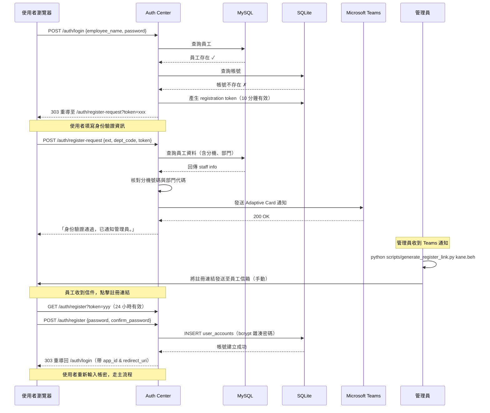
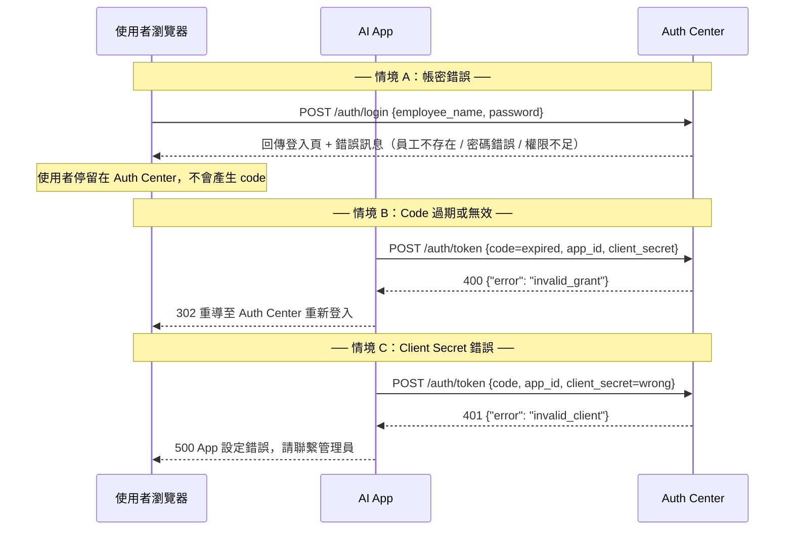
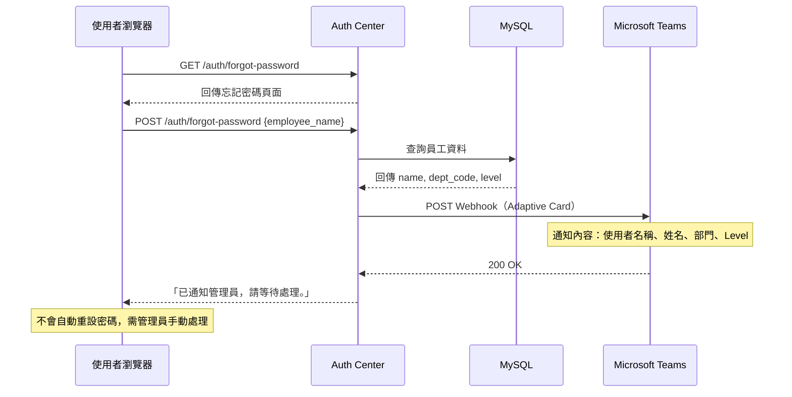
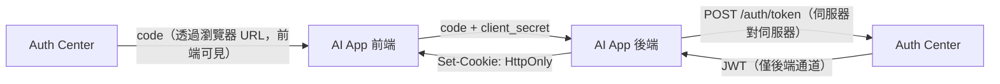
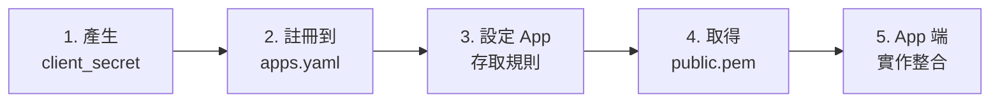
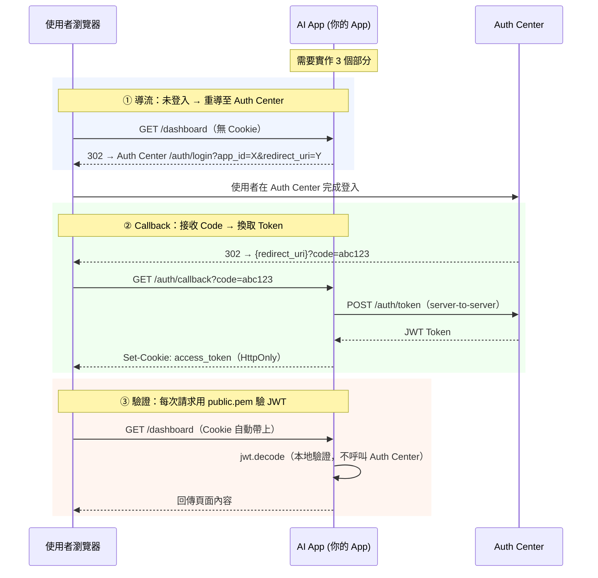
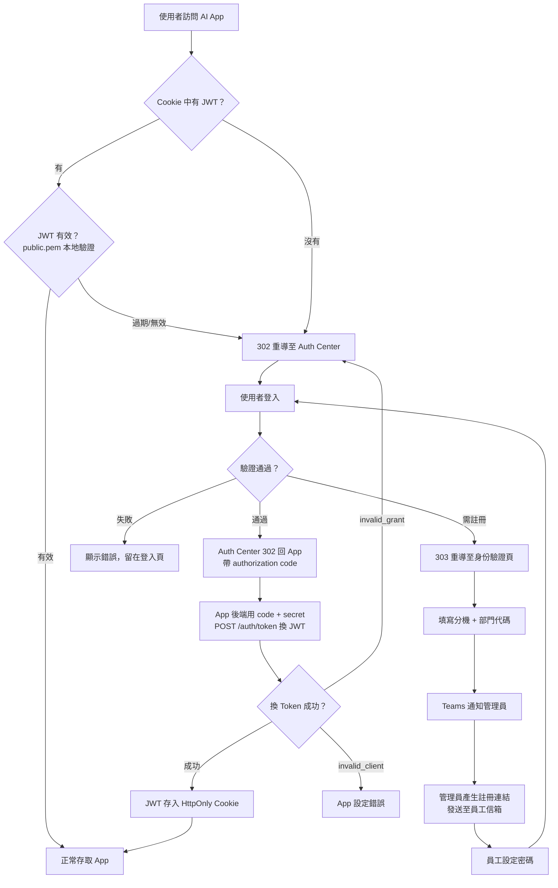

# Auth Center

中央認證系統，為多個內部 AI App 提供統一的單一登入 (SSO) 服務。

## 功能特色

- **OAuth2 Authorization Code Flow** — App 重導登入、code 換 token 標準流程
- **RS256 JWT** — 非對稱加密，Auth Center 簽發、各 App 用公鑰驗證
- **雙資料庫架構** — MySQL（員工主檔，唯讀）+ SQLite（帳號與權限，讀寫）
- **管理員審核註冊** — 員工首次登入需驗證身份（分機 + 部門代碼），通過後 Teams 通知管理員，由管理員產生註冊連結
- **權限分級** — Level 1/2/3 自動映射為 `read` / `read+write` / `read+write+admin` scopes
- **App 存取控制** — 依部門與等級限制 App 存取權限
- **修改密碼** — 使用者可透過 JWT Cookie 驗證後自行修改密碼
- **忘記密碼** — 透過 Microsoft Teams Webhook 通知管理員處理
- **Rate Limiting** — 同一 IP 5 分鐘內最多 10 次登入嘗試，防止暴力破解
- **Jinja2 UI** — 內建登入、身份驗證、註冊、修改密碼、忘記密碼頁面

## 專案結構

```
auth-center/
├── app/
│   ├── main.py              # FastAPI 入口
│   ├── config.py            # 環境變數與 apps.yaml 讀取
│   ├── database.py          # 雙 DB 連線管理
│   ├── models.py            # SQLAlchemy models
│   ├── schemas.py           # Pydantic schemas
│   ├── auth/
│   │   ├── routes.py        # API 路由
│   │   ├── service.py       # 核心業務邏輯
│   │   └── jwt_handler.py   # RS256 JWT 簽發與驗證
│   ├── webhook/
│   │   └── teams.py         # Teams Webhook 通知
│   └── templates/           # Jinja2 前端模板
├── config/
│   └── apps.yaml            # 已註冊 App 清單
├── keys/                    # RSA 金鑰對（gitignore）
├── scripts/
│   ├── init_db.sql                # SQLite 表結構
│   ├── reset_password.py          # 管理員：重設使用者密碼
│   └── generate_register_link.py  # 管理員：產生註冊連結
├── middleware_example/
│   └── app_middleware.py    # App 端驗證範例
├── generate_keys.py         # 金鑰產生腳本
├── requirements.txt
└── .env.example
```

## 快速開始

```bash
# 安裝依賴
pip install -r requirements.txt

# 產生 RSA 金鑰對
python generate_keys.py

# 設定環境變數
cp .env.example .env
# 編輯 .env 填入 MySQL 連線資訊與 Teams Webhook URL

# 啟動服務（開發模式，auto-reload）
fastapi dev app/main.py

# 啟動服務（正式部署）
fastapi run app/main.py
```

## 環境變數

| 變數 | 說明 | 預設值 |
|------|------|--------|
| `MYSQL_HOST` | IT Master DB 主機 | `localhost` |
| `MYSQL_PORT` | MySQL 連接埠 | `3306` |
| `MYSQL_USER` | MySQL 使用者（唯讀） | `root` |
| `MYSQL_PASSWORD` | MySQL 密碼 | — |
| `MYSQL_DATABASE` | MySQL 資料庫名稱 | `it_master` |
| `SQLITE_PATH` | SQLite 檔案路徑 | `./auth_local.db` |
| `PRIVATE_KEY_PATH` | RS256 私鑰路徑 | `./keys/private.pem` |
| `PUBLIC_KEY_PATH` | RS256 公鑰路徑 | `./keys/public.pem` |
| `TEAMS_WEBHOOK_URL` | Microsoft Teams Webhook URL | — |
| `AUTH_CENTER_BASE_URL` | Auth Center 對外 URL | `http://localhost:8000` |

## OAuth2 認證流程（完整說明）

本系統採用類 **OAuth2 Authorization Code Flow**，完整流程如下：

### 主流程：登入成功


### 分支流程：首次登入（管理員審核註冊）



### 分支流程：驗證失敗



### 分支流程：忘記密碼



### Auth Center 內部驗證細節

使用者提交帳密後，Auth Center 依序執行 5 個檢查步驟：

| 步驟 | 操作 | 資料來源 | 失敗結果 |
|------|------|----------|----------|
| ① | 查詢員工是否在職 | MySQL `staff` 表 | 回傳「使用者名稱不存在，請確認後重試。」 |
| ② | 查詢帳號是否已註冊 | SQLite `user_accounts` 表 | 303 重導至 `/auth/register-request`（身份驗證頁） |
| ③ | bcrypt 比對密碼 | SQLite `user_accounts` 表 | 回傳「密碼錯誤，請重新輸入。」 |
| ④ | 檢查 App 存取規則 | SQLite `app_access_rules` 表 | 回傳「部門無權」或「等級不足」 |
| ⑤ | 產生 Authorization Code | SQLite `auth_codes` 表（5 分鐘 TTL） | — |

所有驗證失敗都**不會產生 code**，使用者停留在 Auth Center 頁面直到通過驗證或放棄。

### Authorization Code 是什麼？

Authorization Code 是一個 **一次性、短期有效的隨機字串**（如 `dBjftJeZ4CVP-mB92K27uhbUJU1p...`），用來安全地將認證結果從 Auth Center 傳遞給 AI App：

| 特性 | 說明 |
|------|------|
| **格式** | `secrets.token_urlsafe(32)` 產生的 43 字元隨機字串 |
| **有效期** | 5 分鐘，過期自動作廢 |
| **使用次數** | 一次性，兌換 Token 後立即銷毀 |
| **綁定對象** | 與 `employee_name` + `app_id` 綁定，不可跨 App 使用 |
| **傳遞方式** | 透過 URL query parameter（`?code=xxx`）傳回 App |

**為什麼不直接回傳 JWT？**
Code 透過瀏覽器 URL 傳遞（前端可見），而 JWT 包含敏感資訊。使用 code 中轉，讓 JWT 只在 App 後端與 Auth Center 之間的伺服器對伺服器通道傳輸，避免 Token 暴露在瀏覽器端。



## API 端點

| 方法 | 路徑 | 說明 |
|------|------|------|
| `GET` | `/auth/login?app_id=X&redirect_uri=Y` | 渲染登入頁面 |
| `POST` | `/auth/login` | 提交登入表單，成功後 302 帶 code 回 App |
| `GET` | `/auth/register-request?token=X` | 渲染身份驗證頁面（分機 + 部門代碼） |
| `POST` | `/auth/register-request` | 提交身份驗證，通過後觸發 Teams Webhook |
| `GET` | `/auth/register?token=X` | 渲染註冊頁面（管理員產生的連結） |
| `POST` | `/auth/register` | 提交註冊（設定密碼），完成後導回登入頁 |
| `POST` | `/auth/token` | App 後端用 code + client_secret 換取 JWT |
| `GET` | `/auth/change-password` | 渲染修改密碼頁面（需 JWT Cookie） |
| `POST` | `/auth/change-password` | 提交修改密碼 |
| `GET` | `/auth/forgot-password` | 渲染忘記密碼頁面 |
| `POST` | `/auth/forgot-password` | 觸發 Teams Webhook 通知管理員 |

### `POST /auth/token` 詳細規格

**Request：**

```json
{
  "code": "dBjftJeZ4CVP-mB92K27uhbUJU1p...",
  "app_id": "ai_chat_app",
  "client_secret": "chat_secret_123"
}
```

**Success Response (200)：**

```json
{
  "access_token": "eyJhbGciOiJSUzI1NiJ9...",
  "token_type": "bearer",
  "expires_in": 43200
}
```

**Error Responses：**

```json
// 401 - App 身分驗證失敗（app_id 不存在或 client_secret 錯誤）
{ "error": "invalid_client" }

// 400 - Code 無效、過期或已被使用
{ "error": "invalid_grant" }

// 400 - 員工資料異常
{ "error": "staff_not_found" }
```

## JWT Token 格式

```json
{
  "sub": "kane.beh",    // employee_name (lowercase)
  "name": "王小明",
  "dept": "IT",
  "scopes": ["read", "write"],
  "aud": "ai_chat_app",
  "iat": 1709000000,
  "exp": 1709043200
}
```

| 欄位 | 說明 |
|------|------|
| `sub` | 使用者名稱（來自 MySQL staff_id，如 kane.beh） |
| `name` | 員工姓名 |
| `dept` | 部門代碼 |
| `scopes` | 權限範圍清單，由員工等級自動映射 |
| `aud` | 此 Token 預定存取的 App ID，App 端必須驗證此欄位 |
| `iat` | Token 簽發時間 (Unix timestamp) |
| `exp` | Token 過期時間（簽發後 12 小時） |

**權限映射規則：**

| Level | Scopes |
|-------|--------|
| 1 | `["read"]` |
| 2 | `["read", "write"]` |
| 3 | `["read", "write", "admin"]` |

## 註冊新的 AI App（完整 Onboarding）

要讓一個新的 AI App 接入 Auth Center SSO，需要完成以下步驟：

### Onboarding 流程總覽



### Step 1：產生 Client Secret

每個 App 需要一組 `client_secret`，用於在 Code → Token 交換時驗證 App 身份。`apps.yaml` 中儲存的是 bcrypt 雜湊值，明文由 App 端自行保管。

```python
from passlib.hash import bcrypt

# 自訂一個高強度明文 secret
plain_secret = "my_app_secret_2024"

# 產生 bcrypt hash，貼到 apps.yaml 中
print(bcrypt.hash(plain_secret))
# 輸出類似：$2b$12$LJ3m4ys4Gz8Kl0rVOpAjAe...
```

> **安全提醒**：明文 secret 應存放在 App 的 `.env` 或 secrets manager 中，切勿寫死在程式碼裡或提交到 Git。

### Step 2：在 `config/apps.yaml` 中註冊

將新 App 資訊加入設定檔：

```yaml
apps:
  # ... 現有 App ...

  - app_id: "my_new_app"                # 唯一識別碼，用於 JWT 的 aud 欄位
    client_secret: "$2b$12$..."          # Step 1 產生的 bcrypt hash
    redirect_uri: "https://my-app.example.com/auth/callback"  # App 的 callback URL
    name: "My New App"                   # 顯示名稱，登入頁會顯示「登入以存取 My New App」
```

| 欄位 | 說明 | 注意事項 |
|------|------|----------|
| `app_id` | App 唯一識別碼 | 全小寫 + 底線，如 `ai_chat_app` |
| `client_secret` | bcrypt 雜湊後的密鑰 | 不可存放明文 |
| `redirect_uri` | 登入成功後的回調 URL | 必須完全匹配，包含 protocol 和 port |
| `name` | App 顯示名稱 | 登入頁面「登入以存取 **{name}**」處顯示 |

> **`redirect_uri` 安全規則**：Auth Center 會嚴格比對 `redirect_uri`，防止 Open Redirect 攻擊。URL 必須與 `apps.yaml` 中的設定完全一致（含結尾斜線）。

### Step 3：設定 App 存取規則（可選）

如果要限制哪些部門或等級的員工可以使用此 App，在 SQLite 的 `app_access_rules` 表中新增規則：

```sql
-- 例：只允許 IT 和 RD 部門、Level >= 2 的員工
INSERT INTO app_access_rules (app_id, allowed_depts, min_level)
VALUES ('my_new_app', '["IT", "RD"]', 2);

-- 例：所有部門、Level >= 1（不限制）
INSERT INTO app_access_rules (app_id, allowed_depts, min_level)
VALUES ('my_new_app', '[]', 1);
```

| 欄位 | 說明 |
|------|------|
| `allowed_depts` | JSON 陣列，空陣列 `[]` = 不限部門 |
| `min_level` | 最低員工等級要求（1/2/3） |

**如果沒有設定存取規則**，該 App 預設允許所有員工登入。

### Step 4：取得 Auth Center 公鑰

將 Auth Center 的 `keys/public.pem` 複製到你的 App 專案中。此公鑰用於在 App 端本地驗證 JWT 簽名，**無法用來簽發 Token**。

```bash
# 從 Auth Center 複製公鑰到你的 App 專案
cp /path/to/auth-center/keys/public.pem /path/to/my-app/keys/public.pem
```

### Step 5：App 端實作整合

完成以上設定後，App 端需要實作 3 個功能：導流（重導至 Auth Center）、接收 Code 並換取 Token、驗證 JWT 保護路由。詳見下方「AI App 端整合指南」。

---

## AI App 端整合指南

完整範例請參考 `middleware_example/app_middleware.py`。

### 整合架構



### 前置準備

| 項目 | 說明 |
|------|------|
| **Auth Center 公鑰** | 從 Auth Center 取得 `public.pem`，放到 App 專案中 |
| **apps.yaml 已註冊** | 確認 `app_id`、`client_secret`（bcrypt hash）、`redirect_uri` 已設定 |
| **安裝依賴** | `pip install PyJWT[crypto] httpx` |
| **App 端環境變數** | 設定 `AUTH_CENTER_URL`、`APP_ID`、`CLIENT_SECRET`、`REDIRECT_URI` |

App 端建議的 `.env`：

```env
AUTH_CENTER_URL=http://localhost:8000
APP_ID=my_new_app
CLIENT_SECRET=my_app_secret_2024
REDIRECT_URI=http://localhost:8001/auth/callback
PUBLIC_KEY_PATH=./keys/public.pem
```

### Part 1：導流 — 未登入時重導至 Auth Center

當使用者訪問 App 的受保護頁面，但 Cookie 中沒有有效 JWT 時，**302 重導到 Auth Center 的登入頁面**：

```python
from fastapi.responses import RedirectResponse
import os

AUTH_CENTER = os.getenv("AUTH_CENTER_URL", "http://localhost:8000")
APP_ID = os.getenv("APP_ID", "ai_chat_app")
REDIRECT_URI = os.getenv("REDIRECT_URI", "http://localhost:8001/auth/callback")

@app.get("/protected")
async def protected_page(access_token: str | None = Cookie(default=None)):
    if access_token is None:
        # 重導至 Auth Center 登入頁
        # app_id: Auth Center 用來識別哪個 App 發起請求
        # redirect_uri: 登入成功後要回到哪裡
        return RedirectResponse(
            f"{AUTH_CENTER}/auth/login?app_id={APP_ID}&redirect_uri={REDIRECT_URI}"
        )
    # ... 驗證 token 後正常處理
```

**重導 URL 格式：**

```
https://auth-center.example.com/auth/login?app_id=my_new_app&redirect_uri=https://my-app.example.com/auth/callback
```

| 參數 | 說明 |
|------|------|
| `app_id` | 你在 `apps.yaml` 中註冊的 App ID |
| `redirect_uri` | 登入成功後 Auth Center 會把使用者導回此 URL，必須與 `apps.yaml` 完全一致 |

Auth Center 收到請求後會：
1. 驗證 `app_id` 是否已註冊
2. 驗證 `redirect_uri` 是否與設定一致
3. 在登入頁面顯示「登入以存取 **{App Name}**」

### Part 2：Callback — 接收 Code 並換取 Token

Auth Center 登入成功後，會將使用者重導回你註冊的 `redirect_uri`，URL 中帶有一次性的 `code` 參數：

```
GET http://localhost:8001/auth/callback?code=dBjftJeZ4CVP-mB92K27uhbUJU1p...
```

App 後端需要用這個 code + client_secret 向 Auth Center 後端換取 JWT（**伺服器對伺服器呼叫**，secret 不會暴露在瀏覽器端）：

```python
import httpx
from fastapi import Query, HTTPException
from fastapi.responses import RedirectResponse

CLIENT_SECRET = os.getenv("CLIENT_SECRET")  # 明文 secret，從 .env 讀取

@app.get("/auth/callback")
async def auth_callback(code: str = Query(...)):
    """用 authorization code 向 Auth Center 換取 JWT Token。"""

    # ── Step A：用 code 換 Token（伺服器對伺服器） ──
    async with httpx.AsyncClient() as client:
        resp = await client.post(f"{AUTH_CENTER}/auth/token", json={
            "code": code,             # Auth Center 回傳的一次性授權碼
            "app_id": APP_ID,         # 你的 App ID
            "client_secret": CLIENT_SECRET,  # 你的明文 secret
        })

    data = resp.json()

    # ── Step B：處理錯誤回應 ──
    if resp.status_code != 200:
        error = data.get("error")

        if error == "invalid_grant":
            # Code 已過期（> 5 分鐘）或已被使用（一次性）→ 重新登入
            return RedirectResponse(
                f"{AUTH_CENTER}/auth/login?app_id={APP_ID}&redirect_uri={REDIRECT_URI}"
            )

        if error == "invalid_client":
            # app_id 不存在或 client_secret 不匹配 → App 設定有誤
            raise HTTPException(500, "Auth Center 驗證失敗：App 設定錯誤，請聯繫管理員")

        if error == "staff_not_found":
            # 員工資料異常（極少見）
            raise HTTPException(500, "員工資料異常，請聯繫管理員")

    # ── Step C：將 JWT 存入 HttpOnly Cookie ──
    response = RedirectResponse("/", status_code=303)
    response.set_cookie(
        key="access_token",
        value=data["access_token"],
        httponly=True,     # JS 無法存取，防止 XSS 竊取
        secure=True,       # 僅透過 HTTPS 傳輸（本地開發設 False）
        samesite="lax",    # 防止 CSRF 跨站請求
        max_age=43200,     # 12 小時，與 JWT exp 一致
    )
    return response
```

**Token 交換 API 詳細說明：**

```
POST /auth/token
Content-Type: application/json

{
  "code": "dBjftJeZ4CVP-mB92K27uhbUJU1p...",  ← Auth Center 回傳的授權碼
  "app_id": "my_new_app",                      ← 你的 App ID
  "client_secret": "my_app_secret_2024"         ← 你的明文 secret
}
```

Auth Center 收到後會：
1. 查找 `app_id` 是否已註冊 → 否則回 `401 invalid_client`
2. 用 bcrypt 比對 `client_secret` 與 `apps.yaml` 中的 hash → 不匹配則回 `401 invalid_client`
3. 從 SQLite 中取出 `code` 對應的 `employee_name` + `app_id` → 不存在或過期回 `400 invalid_grant`
4. 驗證 code 中的 `app_id` 與請求的 `app_id` 一致 → 不一致回 `400 invalid_grant`
5. 消耗 code（一次性使用，立即刪除）
6. 查詢 MySQL 取得員工資料 → 查無資料回 `400 staff_not_found`
7. 依據員工 Level 映射 scopes
8. 用 `private.pem` 簽發 RS256 JWT（有效 12 小時）
9. 回傳 `{ "access_token": "eyJ...", "token_type": "bearer", "expires_in": 43200 }`

### Part 3：驗證 JWT 並保護路由

後續每個請求，瀏覽器會自動帶上 Cookie。App 使用 `public.pem` 在本地驗證 JWT，**不需要再呼叫 Auth Center**：

```python
import jwt
from pathlib import Path

PUBLIC_KEY = Path(os.getenv("PUBLIC_KEY_PATH", "./keys/public.pem")).read_text()

def get_current_user(access_token: str | None = Cookie(default=None)) -> dict:
    """從 Cookie 取出 JWT 並驗證。"""
    if access_token is None:
        raise HTTPException(401, "Not authenticated")

    try:
        payload = jwt.decode(
            access_token,
            PUBLIC_KEY,
            algorithms=["RS256"],
            audience=APP_ID,        # 驗證此 Token 是簽給本 App 的
        )
    except jwt.ExpiredSignatureError:
        raise HTTPException(401, "Token expired, please login again")
    except jwt.InvalidAudienceError:
        raise HTTPException(403, "Token not intended for this app")
    except jwt.PyJWTError as e:
        raise HTTPException(401, f"Invalid token: {e}")

    return payload
    # payload 內容：{"sub": "kane.beh", "name": "王小明", "dept": "IT", "scopes": ["read", "write"], "aud": "my_new_app", ...}


# 使用 FastAPI Depends 保護路由
@app.get("/dashboard")
async def dashboard(user: dict = Depends(get_current_user)):
    return {"message": f"Hello {user['name']}", "scopes": user["scopes"]}


# 需要特定 scope 的路由
def require_scopes(required: list[str]):
    """Dependency factory：驗證使用者是否擁有所需的 scopes。"""
    def checker(user: dict = Depends(get_current_user)):
        missing = set(required) - set(user.get("scopes", []))
        if missing:
            raise HTTPException(403, f"權限不足，缺少：{missing}")
        return user
    return checker

@app.get("/admin")
async def admin_panel(user: dict = Depends(require_scopes(["read", "admin"]))):
    return {"admin": True, "user": user["name"]}
```

### 完整流程總結



### Checklist：App 整合完成確認

- [ ] `apps.yaml` 已新增 App 設定（app_id, client_secret hash, redirect_uri, name）
- [ ] `app_access_rules` 已設定存取規則（或確認不需限制）
- [ ] App 專案中有 `public.pem`
- [ ] App `.env` 中設定了 `AUTH_CENTER_URL`、`APP_ID`、`CLIENT_SECRET`、`REDIRECT_URI`
- [ ] 實作了未登入時的 302 重導邏輯
- [ ] 實作了 `/auth/callback` 端點（code → token 交換）
- [ ] Token 存入 HttpOnly + Secure + SameSite Cookie
- [ ] 實作了 `get_current_user` JWT 驗證（含 audience 檢查）
- [ ] 測試：完整登入流程（導流 → 登入 → callback → 受保護頁面）
- [ ] 測試：Token 過期後自動重導重新登入

## 資料庫架構

**IT Master DB (MySQL，唯讀)**

| 欄位 | 型別 | 說明 |
|------|------|------|
| `employee_name` | VARCHAR(50) PK | 使用者名稱 |
| `name` | VARCHAR | 姓名 |
| `dept_code` | VARCHAR | 部門代碼 |
| `level` | INT | 權限等級 (1-3) |
| `ext` | VARCHAR | 分機號碼（用於身份驗證） |

**Auth Local DB (SQLite，讀寫)**

`user_accounts` — 員工帳號密碼

| 欄位 | 型別 | 說明 |
|------|------|------|
| `employee_name` | VARCHAR(50) PK | 使用者名稱 |
| `password_hash` | VARCHAR(255) | bcrypt 雜湊 |
| `created_at` | DATETIME | 建立時間 |
| `updated_at` | DATETIME | 更新時間 |

`app_access_rules` — App 存取門檻

| 欄位 | 型別 | 說明 |
|------|------|------|
| `id` | INTEGER PK | 自增 ID |
| `app_id` | VARCHAR(100) UNIQUE | App 識別碼 |
| `allowed_depts` | TEXT | JSON 陣列，允許部門（空 = 全部） |
| `min_level` | INTEGER | 最低等級要求 |

`auth_codes` — 一次性 Authorization Code

| 欄位 | 型別 | 說明 |
|------|------|------|
| `code` | VARCHAR(64) PK | 隨機授權碼 |
| `employee_name` | VARCHAR(50) | 使用者名稱 |
| `app_id` | VARCHAR(100) | 目標 App |
| `expires_at` | REAL | 過期時間（Unix timestamp，5 分鐘） |

`registration_tokens` — 註冊令牌（身份驗證 / 管理員產生）

| 欄位 | 型別 | 說明 |
|------|------|------|
| `token` | VARCHAR(64) PK | 隨機令牌 |
| `employee_name` | VARCHAR(50) | 使用者名稱 |
| `app_id` | VARCHAR(100) | 來源 App（可為空） |
| `redirect_uri` | TEXT | 註冊完成後的導回 URI |
| `expires_at` | REAL | 過期時間（登入產生 10 分鐘 / 管理員產生 24 小時） |

## 管理員 CLI 工具

### 產生註冊連結

當 Teams 收到新員工註冊請求後，管理員核對身份後執行此指令產生 24 小時有效的註冊連結：

```bash
# 基本用法
python scripts/generate_register_link.py kane.beh

# 帶 App 資訊（註冊完成後可直接導回 App 登入）
python scripts/generate_register_link.py kane.beh --app-id ai_chat_app --redirect-uri http://localhost:8001/callback
```

產出範例：
```
[OK] Registration link generated for kane.beh
     Expires in 24 hours

     http://localhost:8000/auth/register?token=abc123...

Please send this link to the employee's email.
```

### 重設密碼

當 Teams 收到忘記密碼通知後，管理員執行此指令重設密碼：

```bash
# 自動產生隨機密碼
python scripts/reset_password.py kane.beh

# 指定密碼
python scripts/reset_password.py kane.beh --password NewPass123
```

## 安全機制

| 機制 | 說明 |
|------|------|
| **Rate Limiting** | 同一 IP 5 分鐘內最多 10 次登入/忘記密碼嘗試 |
| **Redirect URI 驗證** | GET 和 POST 均嚴格比對 `apps.yaml` 中的設定，防止 Open Redirect |
| **註冊頁面保護** | 所有註冊相關頁面均需有效 token 才能存取 |
| **身份驗證** | 首次註冊需核對分機號碼與部門代碼（比對 MySQL） |
| **bcrypt 密碼雜湊** | 密碼使用 bcrypt 單向雜湊儲存 |
| **Authorization Code** | 一次性、5 分鐘過期、SQLite 儲存（支援多 worker） |
| **HttpOnly Cookie** | JWT 存於 HttpOnly Cookie，JS 無法存取 |
| **RS256 非對稱簽名** | 私鑰僅 Auth Center 持有，App 端只需公鑰驗證 |
