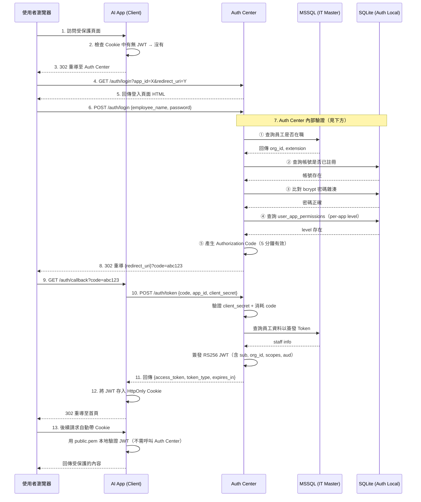
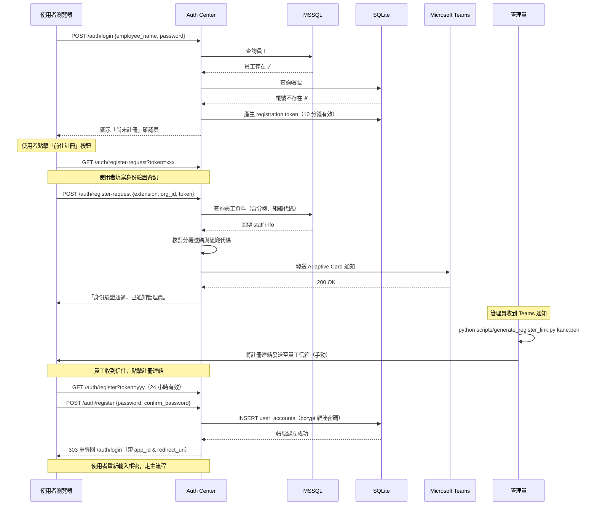
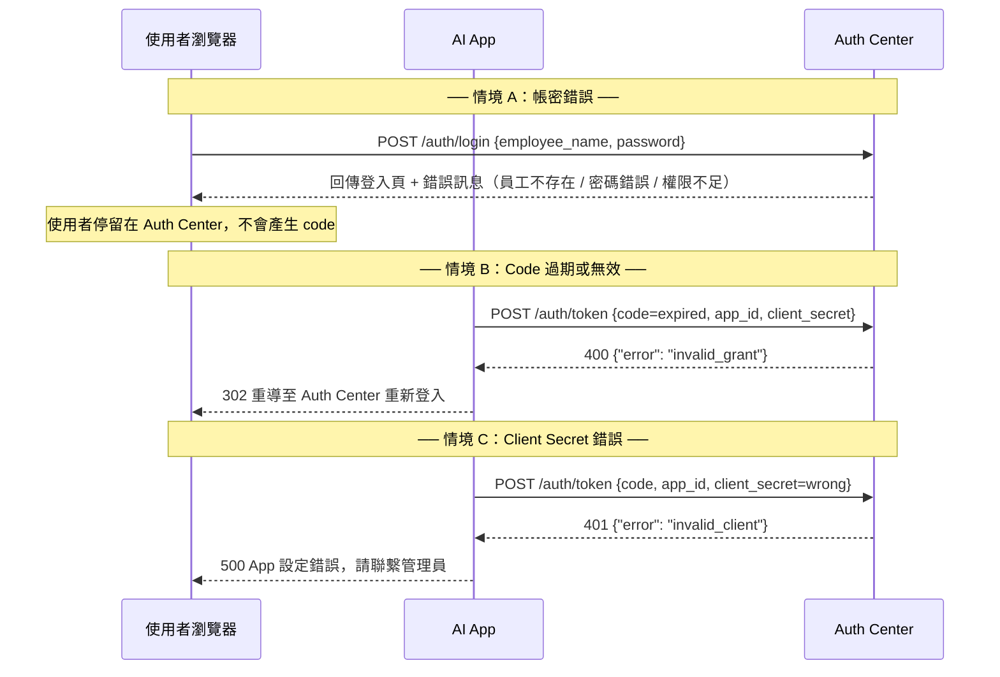
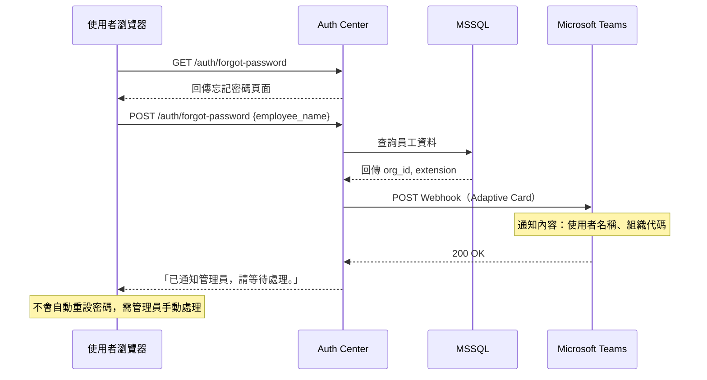
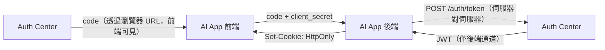
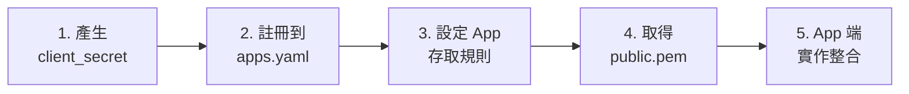
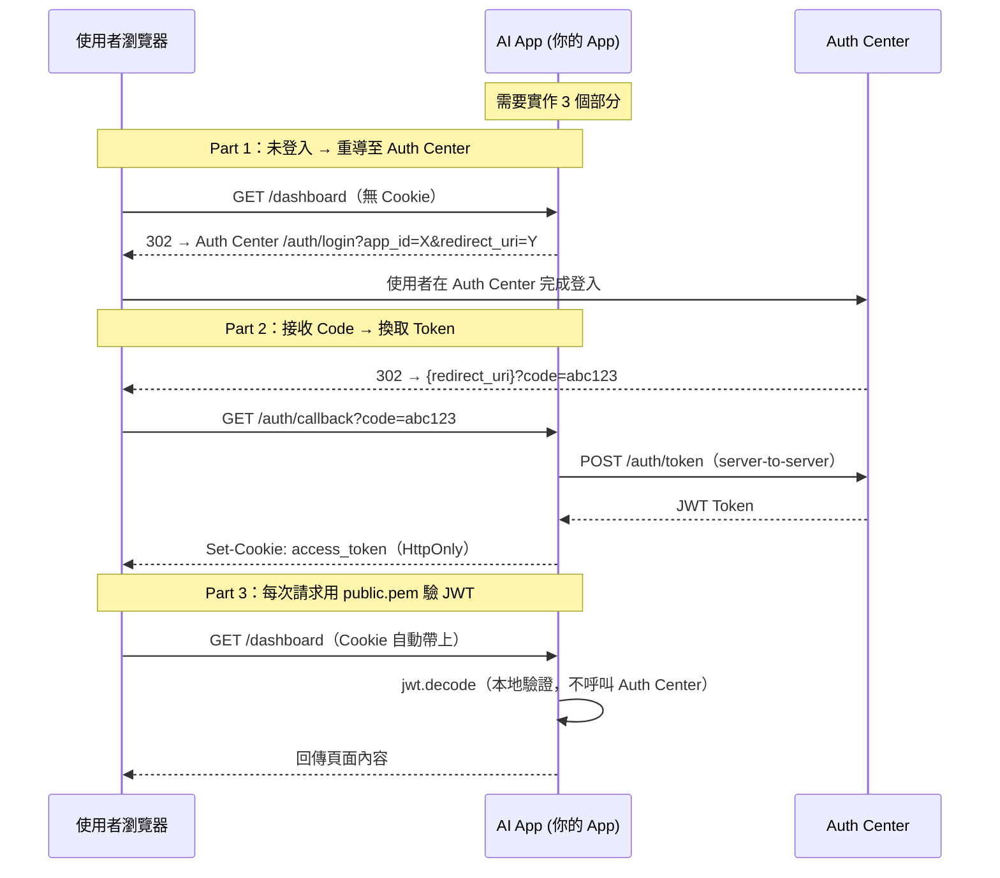

# Auth Center

中央認證系統，為多個內部 AI App 提供統一的單一登入 (SSO) 服務。

> 📄 **[Auth Center SSO Guide (PDF)](docs/Auth_Center_SSO_Guide.pdf)** — 完整簡報，適合快速了解系統架構與流程

---

## 目錄

1. [簡介](#1-簡介)
2. [系統架構總覽](#2-系統架構總覽)
3. [快速開始（安裝與啟動）](#3-快速開始安裝與啟動)
4. [環境變數說明](#4-環境變數說明)
5. [Admin 管理後台](#5-admin-管理後台)
   - [Super Admin 使用教學](#51-super-admin-使用教學)
   - [App Admin 使用教學](#52-app-admin-使用教學)
6. [OAuth2 認證流程](#6-oauth2-認證流程)
7. [註冊新的 AI App（Onboarding）](#7-註冊新的-ai-apponboarding)
8. [AI App 端整合指南](#8-ai-app-端整合指南)
9. [使用者功能](#9-使用者功能)
10. [API 端點參考](#10-api-端點參考)
11. [JWT Token 格式](#11-jwt-token-格式)
12. [資料庫架構](#12-資料庫架構)
13. [CLI 管理工具](#13-cli-管理工具)
14. [安全機制](#14-安全機制)
15. [安全測試](#15-安全測試)
16. [專案結構](#16-專案結構)

---

## 1. 簡介

Auth Center 是一個為內部 AI 應用程式設計的中央認證服務，提供：

- **統一登入 (SSO)** — 員工只需一組帳密，就能登入所有接入的 AI App
- **OAuth2 Authorization Code Flow** — 標準安全的認證流程
- **RS256 JWT** — 非對稱加密，Auth Center 用私鑰簽發 Token，各 App 用公鑰驗證
- **兩層 Admin 管理** — Super Admin 管理全局，App Admin 管理各自負責的 App
- **Per-User-Per-App 權限** — 可為每位使用者在每個 App 設定個別的存取權限
- **完整 Audit Log** — 所有管理操作都有紀錄，方便追蹤與稽核

### 本系統適合誰？

- **系統管理員**：部署 Auth Center 並管理所有 App 與使用者權限
- **App 開發者**：將自己的 AI App 接入 Auth Center SSO
- **App Admin**：管理自己負責的 App 的使用者存取權限

---

## 2. 系統架構總覽

```
┌─────────────┐    ┌─────────────┐    ┌─────────────┐
│ AI Chat App │    │ AI Report   │    │  其他 App   │
│  (Client)   │    │  (Client)   │    │  (Client)   │
└──────┬──────┘    └──────┬──────┘    └──────┬──────┘
       │                  │                  │
       └──────────────────┼──────────────────┘
                          │ OAuth2 Flow
                   ┌──────┴──────┐
                   │ Auth Center │
                   │  (FastAPI)  │
                   └──────┬──────┘
                          │
              ┌───────────┼───────────┐
              │                       │
    ┌─────────┴─────────┐  ┌─────────┴─────────┐
    │  MSSQL (唯讀)     │  │  SQLite (讀寫)    │
    │  員工主檔資料      │  │  帳號、權限、      │
    │  (IT Master DB)   │  │  Admin 設定       │
    └───────────────────┘  └───────────────────┘
```

**技術棧**

| 項目 | 技術 |
|------|------|
| 後端框架 | FastAPI (Python) |
| JWT 簽發 | PyJWT + RS256 非對稱加密 |
| 密碼雜湊 | passlib + bcrypt |
| 員工資料庫 | MSSQL (aioodbc，唯讀) |
| 認證資料庫 | SQLite (aiosqlite，讀寫) |
| 前端模板 | Jinja2 |
| 通知 | Microsoft Teams Webhook |
| App 註冊 | YAML 設定檔 (`config/apps.yaml`) |

---

## 3. 快速開始（安裝與啟動）

### 前置需求

- Python 3.11+
- MSSQL（員工主檔資料庫，需安裝 ODBC Driver）
- Microsoft Teams Webhook URL（可選，用於通知）

### Step 1：安裝 ODBC Driver（Linux）

`aioodbc` 需要 Microsoft ODBC Driver 才能連接 MSSQL。

**方式 A：線上安裝**（機器可連網）

```bash
# Ubuntu / Debian
curl https://packages.microsoft.com/keys/microsoft.asc | sudo tee /etc/apt/trusted.gpg.d/microsoft.asc
curl https://packages.microsoft.com/config/ubuntu/$(lsb_release -rs)/prod.list | sudo tee /etc/apt/sources.list.d/mssql-release.list

sudo apt update
sudo ACCEPT_EULA=Y apt install -y msodbcsql17 unixodbc-dev
```

**方式 B：離線安裝**（Airgapped 環境）

在有網路的機器上先下載所有 `.deb` 包：

```bash
# 在有網路的同版本 Ubuntu 機器上
mkdir odbc-offline && cd odbc-offline
apt download msodbcsql17 unixodbc libodbc2 libodbcinst2 odbcinst
```

將 `odbc-offline/` 資料夾搬到目標機器（USB、內網傳輸等），然後安裝：

```bash
cd odbc-offline
sudo ACCEPT_EULA=Y dpkg -i *.deb
# 若有依賴問題
sudo apt --fix-broken install
```

**驗證安裝**

```bash
odbcinst -q -d
# 應輸出: [ODBC Driver 17 for SQL Server]
```

> 若使用 Driver 18，請同步修改 `.env` 中的 `MSSQL_DRIVER`。

### Step 2：安裝 Python 依賴

```bash
# 使用 uv（推薦）
uv sync

# 或使用 pip
pip install -r requirements.txt
```

### Step 3：產生 RSA 金鑰對

JWT 簽發需要一對 RSA 金鑰。執行以下指令會在 `keys/` 資料夾產生 `private.pem` 和 `public.pem`：

```bash
python generate_keys.py
```

> `private.pem` 僅 Auth Center 持有，用於簽發 JWT。`public.pem` 需提供給各 AI App，用於驗證 JWT。

### Step 4：設定環境變數

```bash
cp .env.example .env
cp config/apps.yaml.example config/apps.yaml
```

編輯 `.env`，填入必要資訊：

```env
# MSSQL 連線（員工資料庫）
MSSQL_HOST=192.168.1.100
MSSQL_PORT=1433
MSSQL_USER=readonly_user
MSSQL_PASSWORD=your_mssql_password
MSSQL_DATABASE=it_master
MSSQL_DRIVER=ODBC Driver 17 for SQL Server
MSSQL_TABLE=staff

# SQLite 路徑（自動建立）
SQLITE_PATH=./auth_local.db

# RSA 金鑰路徑（建議用絕對路徑）
PRIVATE_KEY_PATH=D:/project/auth-center/keys/private.pem
PUBLIC_KEY_PATH=D:/project/auth-center/keys/public.pem

# Teams Webhook（可選）
TEAMS_WEBHOOK_URL=https://your-org.webhook.office.com/webhookb2/xxx
# HTTP Proxy（內網環境需透過 Proxy 連外網時設定）
# HTTP_PROXY=http://proxy.company.com:8080

# Server
APP_PORT=8000
AUTH_CENTER_BASE_URL=http://localhost:8000

# Super Admin 帳密
ADMIN_USERNAME=admin
ADMIN_PASSWORD=your_secure_password
# 指定員工為 Super Admin（逗號分隔，可與上方帳密並存）
SUPER_ADMIN_EMPLOYEES=kane.beh,john.doe
```

> **注意**：RSA 金鑰路徑建議使用**絕對路徑**，避免在不同目錄啟動時找不到檔案。

### Step 5：環境檢查（Preflight Check）

啟動前建議先跑環境檢查，逐步確認所有元件是否正確設定：

```bash
python scripts/preflight_check.py

# 額外測試查詢特定員工
python scripts/preflight_check.py --test-user kane.beh
```

會依序檢查 8 個項目：`.env` 環境變數 → ODBC Driver → MSSQL 連線 → SQLite 讀寫 → RSA 金鑰 → apps.yaml → Super Admin → Teams Webhook。每項顯示 `[PASS]` / `[FAIL]`，最後列出所有失敗項目及修正建議。

### Step 6：啟動服務

**方式 A：直接執行（開發 / 測試）**

```bash
# 開發模式（auto-reload）
fastapi dev app/main.py

# 正式模式
fastapi run app/main.py
```

**方式 B：Docker 部署**

```bash
# 1. 準備設定檔
cp .env.example .env        # 編輯填入實際設定
cp config/apps.yaml.example config/apps.yaml

# 2. 準備 ODBC Driver（離線安裝）
#    將預先下載的 .deb 檔案放到 odbc-offline/ 目錄
mkdir -p odbc-offline
cp /path/to/your/odbc-debs/*.deb odbc-offline/

# 3. Build image（內網需透過 Proxy 安裝 Python 套件）
docker compose build \
  --build-arg http_proxy=http://proxy.company.local:8080 \
  --build-arg https_proxy=http://proxy.company.local:8080

# 4. 啟動（首次會自動產生 RSA 金鑰）
docker compose up -d

# 5. 查看日誌
docker compose logs -f

# 常用指令
docker compose restart        # 重啟
docker compose down           # 停止
docker compose up -d --build  # 重新 build 後啟動
```

Docker 部署會自動：
- 從 `odbc-offline/` 離線安裝 ODBC Driver 17（不需連外網）
- 首次啟動產生 RSA 金鑰對
- 持久化 SQLite DB（`data/`）、RSA 金鑰（`keys/`）、App 註冊表（`config/apps.yaml`）

> 不需 Proxy 的環境可省略 `--build-arg` 參數。

**方式 C：systemd 一鍵部署（Linux）**

```bash
# 一鍵部署（安裝依賴、設定 systemd + nginx）
bash deploy/setup.sh

# 內網需透過 Proxy 時
http_proxy="http://proxy.company.local:8080" bash deploy/setup.sh
```

啟動後：
- 使用者登入頁面：`http://localhost:8000/auth/login?app_id=YOUR_APP_ID&redirect_uri=YOUR_REDIRECT_URI`
- Admin 管理後台：`http://localhost:8000/admin/login`

### Step 7：驗證安裝

1. 打開瀏覽器，前往 `http://localhost:8000/`（使用者首頁，含服務說明與常用功能導引）
2. 前往 `http://localhost:8000/admin/login`，輸入 `.env` 中設定的 `ADMIN_USERNAME` / `ADMIN_PASSWORD`
3. 成功登入後會看到 Admin Dashboard，navbar 最右側有「使用指南」可查閱管理操作說明

---

## 4. 環境變數說明

| 變數 | 說明 | 預設值 | 必填 |
|------|------|--------|:----:|
| `MSSQL_HOST` | IT Master DB 主機 | `localhost` | |
| `MSSQL_PORT` | MSSQL 連接埠 | `1433` | |
| `MSSQL_USER` | MSSQL 使用者（唯讀） | `sa` | |
| `MSSQL_PASSWORD` | MSSQL 密碼 | — | * |
| `MSSQL_DATABASE` | MSSQL 資料庫名稱 | `it_master` | |
| `MSSQL_DRIVER` | ODBC 驅動程式名稱 | `ODBC Driver 17 for SQL Server` | |
| `MSSQL_TABLE` | 員工資料表名稱 | `staff` | |
| `SQLITE_PATH` | SQLite 檔案路徑 | `./auth_local.db` | |
| `PRIVATE_KEY_PATH` | RS256 私鑰路徑 | `./keys/private.pem` | * |
| `PUBLIC_KEY_PATH` | RS256 公鑰路徑 | `./keys/public.pem` | * |
| `TEAMS_WEBHOOK_URL` | Microsoft Teams Webhook URL | — | |
| `HTTP_PROXY` | HTTP Proxy（內網環境透過 Proxy 發送 Webhook） | — | |
| `APP_PORT` | 服務監聽埠 | `8000` | |
| `AUTH_CENTER_BASE_URL` | Auth Center 對外 URL | `http://localhost:8000` | |
| `ADMIN_USERNAME` | Super Admin 帳號 | `admin` | * |
| `ADMIN_PASSWORD` | Super Admin 密碼 | — | * |
| `SUPER_ADMIN_EMPLOYEES` | 指定為 Super Admin 的員工（逗號分隔） | — | |

---

## 5. Admin 管理後台

Auth Center 有兩層管理員，各自的權限不同：

| 功能 | Super Admin | App Admin |
|------|:-----------:|:---------:|
| 查看 Dashboard | 全部 App 統計 | 僅自己管理的 App |
| App 管理 — 新增/刪除 | ✓ | ✗ |
| App 管理 — 編輯設定（允許組織、預設權限、Token 時間） | ✓ | ✓（僅自己的 App） |
| 使用者權限管理（所有 App） | ✓ | ✗ |
| 使用者權限管理（自己的 App） | ✓ | ✓ |
| 會員管理（重設密碼 / 刪除帳號） | ✓ | ✗ |
| 指定 / 移除 App Admin | ✓ | ✗ |
| 查看存取紀錄 | 全部 App | 僅自己管理的 App |
| 查看 Audit Log | 全部紀錄 | 僅相關紀錄 |

### 5.1 Super Admin 使用教學

Super Admin 是 Auth Center 的最高管理員，支援兩種登入方式：

- **方式 A**：使用 `.env` 中的 `ADMIN_USERNAME` / `ADMIN_PASSWORD` 固定帳密
- **方式 B**：在 `.env` 設定 `SUPER_ADMIN_EMPLOYEES=kane.beh,john.doe`，指定的員工用自己的密碼登入即擁有 Super Admin 權限

兩種方式可同時啟用。

#### Step 1：登入

1. 打開瀏覽器，前往 `http://localhost:8000/admin/login`
2. 輸入帳號和密碼（固定帳密或員工帳密皆可）
3. 登入成功後進入 Dashboard

> Super Admin JWT 有效時間為 2 小時，過期後需重新登入。

#### Step 2：查看 Dashboard

Dashboard 顯示系統總覽資訊：

- **已註冊 App 數量**：目前有多少 AI App 接入
- **個人權限數量**：已設定的 per-user-per-app 權限總數
- **App Admin 數量**：已指定的 App Admin 人數
- **待處理註冊數量**：尚未完成註冊的員工請求
- **App 列表**：每個 App 的名稱、存取規則、個人權限數
- **待處理的註冊請求**：列出所有未過期的註冊請求，可直接點擊「產生註冊連結」按鈕產生 24 小時有效的註冊連結（取代 CLI 工具）

#### Step 3：管理 App（新增 / 編輯 / 刪除）

前往「**App 管理**」頁面（導覽列 → App管理）：

**新增 App：**

1. 在頁面底部的「新增應用程式」區塊填寫：
   - **App ID**：唯一識別碼（小寫英文 + 底線，如 `ai_chat_app`）
   - **名稱**：顯示名稱（如 `AI Chat Assistant`）
   - **Redirect URI**：App 的 callback URL（如 `http://localhost:8001/auth/callback`）
2. 點擊「新增」
3. 系統會自動產生 `client_secret`，**此密碼只會顯示一次**，請立即複製保存
4. 將 `client_secret` 交給 App 開發者，存放在 App 的 `.env` 中

**編輯 App 存取規則：**

1. 在 App 列表中找到目標 App
2. 透過「允許組織」的下拉選單選取組織代碼（從 IT Master DB 自動載入可用組織），可選「全部組織」一次加入所有組織；已選的組織會以標籤顯示，點擊 × 可移除；留空表示不限組織
3. 設定「預設權限」等級（僅支援 Level 1 和 Level 2，Level 3 必須逐人手動授權；需先設定允許組織才生效）
4. 點擊「儲存」

**刪除 App：**

1. 點擊目標 App 的「刪除」按鈕
2. 確認刪除

> **注意**：刪除 App 不會自動清除已授予的個人權限記錄。

#### Step 4：管理使用者權限

前往「**權限管理**」頁面（導覽列 → 權限管理）：

**授予個人權限：**

1. 在頁面底部的「新增授權」區塊：
   - 輸入**使用者名稱**（如 `kane.beh`）
   - 選擇**目標 App**
   - 選擇**權限等級** (Level)：1 = Read、2 = Read + Write、3 = Full Admin
2. 點擊「授權」

**撤銷權限：**

1. 在權限列表中找到目標記錄
2. 點擊「撤銷」

> 撤銷權限後，該使用者將無法存取該 App（必須有明確的 level 授權才能存取）。

**搜尋 / 篩選：**

- 可依「使用者名稱」或「App ID」模糊搜尋（支援部分名稱）

#### Step 5：會員管理

前往「**會員管理**」頁面（導覽列 → 會員管理）：

此頁面列出所有已註冊的 AuthCenter 帳號，依**組織代碼**分組展開。

**重設密碼：**

1. 展開目標組織，找到使用者
2. 點擊「重設密碼」
3. 系統自動產生新密碼並顯示在頁面上（僅顯示一次，請立即複製）

**刪除帳號：**

1. 展開目標組織，找到使用者
2. 點擊「刪除」→ 確認刪除

> **注意**：刪除帳號會**同時移除**該使用者的所有 App 權限記錄，且無法復原。

**搜尋：**

- 可依使用者名稱搜尋篩選

#### Step 6：指定 App Admin

前往「**Admin 管理**」頁面（導覽列 → Admin 管理）：

1. 在「指定 App Admin」區塊：
   - 輸入**員工名稱**（如 `kane.beh`，該員工必須已在系統註冊）
   - 選擇**負責管理的 App**
2. 點擊「指定」

該員工就可以用自己的帳密登入 Admin 後台，管理被指定 App 的使用者權限。

**Level 3 自動同步：**

- 當授予使用者 Level 3（Admin）權限時，該使用者會自動成為該 App 的 App Admin
- 當使用者的權限從 Level 3 降級或被撤銷時，自動移除其 App Admin 身份（僅限自動指派的）
- Super Admin 手動指派的 App Admin 不受 Level 3 降級影響

**移除 App Admin：**

- 在 App Admin 列表中，點擊「移除」按鈕

> 同一位員工可以同時管理多個 App（分別指定即可）。

#### Step 7：查看存取紀錄

前往「**存取紀錄**」頁面（導覽列 → 存取紀錄）：

記錄使用者透過 AuthCenter 登入 App 並取得 Token 的歷史：

- **統計資訊**：總存取次數、今日存取次數、今日活躍人數
- **篩選功能**：可依 App 或使用者名稱過濾
- **記錄內容**：時間、使用者名稱、App 名稱、IP 位址

#### Step 8：查看操作紀錄

前往「**操作紀錄**」頁面（導覽列 → 操作紀錄）：

所有管理操作都會自動記錄，包括：

| 操作類型 | 說明 |
|----------|------|
| `login` | 管理員登入 |
| `grant_permission` | 授予使用者權限 |
| `revoke_permission` | 撤銷使用者權限 |
| `create_app` | 新增 App |
| `update_app` | 更新 App 設定 |
| `delete_app` | 刪除 App |
| `assign_app_admin` | 指定 App Admin |
| `remove_app_admin` | 移除 App Admin |
| `generate_register_link` | 產生員工註冊連結 |
| `reset_password` | 重設使用者密碼 |
| `delete_user` | 刪除使用者帳號 |

每筆紀錄包含：操作時間、操作者、操作類型、對象、詳情。

### 5.2 App Admin 使用教學

App Admin 由 Super Admin 指定，用自己的員工帳密登入，只能管理被指定 App 的使用者權限。

#### 前提條件

- 你的員工帳號已在 Auth Center 註冊
- Super Admin 已將你指定為某個 App 的 Admin（參見 [5.1 Step 5](#step-5指定-app-admin)）

#### Step 1：登入

1. 前往 `http://localhost:8000/admin/login`
2. 輸入你的**員工帳號**和**密碼**（跟一般登入的帳密相同）
3. 登入成功後進入 Dashboard

> 如果你的帳號沒有被指定為任何 App 的 Admin，登入時會顯示「您沒有管理員權限」。

#### Step 2：查看 Dashboard

Dashboard 只會顯示你負責管理的 App 資訊（不會看到其他 App）。

> **Admin 管理**和**會員管理**不會出現在導覽列中，因為這些功能僅限 Super Admin。App Admin 可以在「App 管理」頁面編輯自己負責的 App 設定（允許組織、預設權限、Token 有效時間），但無法新增或刪除 App。

#### Step 3：管理使用者權限

前往「**權限管理**」頁面：

**你只會看到你負責管理的 App 的權限記錄。**

**授予權限：**

1. 輸入使用者名稱
2. 選擇你管理的 App（下拉選單只會列出你負責的 App）
3. 選擇權限等級 (Level)：1 = Read、2 = Read + Write、3 = Full Admin
4. 點擊「授權」

**撤銷權限：**

1. 找到目標記錄，點擊「撤銷」

> 你無法為其他 App 授權或撤銷權限，系統會自動過濾。

#### Step 4：管理 App 設定

前往「**App 管理**」頁面：

你可以編輯自己負責管理的 App 的以下設定：
- **允許組織**：指定哪些組織的員工可以存取此 App
- **預設權限**：組織內員工的預設權限等級（僅支援 Level 1 和 Level 2）
- **Token 有效時間**：JWT Token 的有效小時數

> 你無法新增或刪除 App，這些操作僅限 Super Admin。

#### Step 5：查看存取紀錄

前往「**存取紀錄**」頁面：

顯示你負責管理的 App 的使用者存取紀錄，包含統計資訊和篩選功能。

#### Step 6：查看操作紀錄

前往「**操作紀錄**」頁面：

只會顯示與你或你管理的 App 相關的紀錄。

---

## 6. OAuth2 認證流程

### 主流程：使用者登入


```mermaid
sequenceDiagram
    participant U as 使用者瀏覽器
    participant A as AI App (Client)
    participant C as Auth Center
    participant M as MSSQL (IT Master)
    participant S as SQLite (Auth Local)

    U->>A: 1. 訪問受保護頁面
    A->>A: 2. 檢查 Cookie 中有無 JWT → 沒有
    A-->>U: 3. 302 重導至 Auth Center

    U->>C: 4. GET /auth/login?app_id=X&redirect_uri=Y
    C-->>U: 5. 回傳登入頁面 HTML

    U->>C: 6. POST /auth/login {employee_name, password}

    Note over C,S: 7. Auth Center 內部驗證（見下方）
    C->>M: ① 查詢員工是否在職
    M-->>C: 回傳 org_id, extension
    C->>S: ② 查詢帳號是否已註冊
    S-->>C: 帳號存在
    C->>S: ③ 比對 bcrypt 密碼雜湊
    S-->>C: 密碼正確
    C->>S: ④ 查詢 user_app_permissions（per-app level）
    S-->>C: level 存在
    C->>C: ⑤ 產生 Authorization Code（5 分鐘有效）

    C-->>U: 8. 302 重導 {redirect_uri}?code=abc123
    U->>A: 9. GET /auth/callback?code=abc123

    A->>C: 10. POST /auth/token {code, app_id, client_secret}
    C->>C: 驗證 client_secret + 消耗 code
    C->>M: 查詢員工資料以簽發 Token
    M-->>C: staff info
    C->>C: 簽發 RS256 JWT（含 sub, org_id, scopes, aud）
    C-->>A: 11. 回傳 {access_token, token_type, expires_in}

    A->>A: 12. 將 JWT 存入 HttpOnly Cookie
    A-->>U: 302 重導至首頁

    U->>A: 13. 後續請求自動帶 Cookie
    A->>A: 用 public.pem 本地驗證 JWT（不需呼叫 Auth Center）
    A-->>U: 回傳受保護的內容
```

### 內部驗證步驟

使用者提交帳密後，Auth Center 依序執行 5 個檢查步驟：

| 步驟 | 操作 | 資料來源 | 失敗結果 |
|------|------|----------|----------|
| ① | 查詢員工是否在職 | MSSQL `staff` 表 | 回傳「使用者名稱或密碼錯誤」（統一錯誤訊息防列舉） |
| ② | 查詢帳號是否已註冊 | SQLite `user_accounts` 表 | 顯示「尚未註冊」確認頁，使用者可選擇前往註冊或返回登入 |
| ③ | bcrypt 比對密碼 | SQLite `user_accounts` 表 | 回傳「使用者名稱或密碼錯誤」 |
| ④ | 檢查 App 存取權限 | `allowed_orgs` + `user_app_permissions` | 回傳「組織無權」或「無存取權限」(403) |
| ⑤ | 產生 Authorization Code | SQLite `auth_codes` 表（5 分鐘 TTL） | — |

### 分支流程：首次登入（管理員審核註冊）


```mermaid
sequenceDiagram
    participant U as 使用者瀏覽器
    participant C as Auth Center
    participant M as MSSQL
    participant S as SQLite
    participant T as Microsoft Teams
    participant A as 管理員

    U->>C: POST /auth/login {employee_name, password}
    C->>M: 查詢員工
    M-->>C: 員工存在 ✓
    C->>S: 查詢帳號
    S-->>C: 帳號不存在 ✗

    C->>S: 產生 registration token（10 分鐘有效）
    C-->>U: 顯示「尚未註冊」確認頁

    Note over U: 使用者點擊「前往註冊」按鈕
    U->>C: GET /auth/register-request?token=xxx

    Note over U,C: 使用者填寫身份驗證資訊
    U->>C: POST /auth/register-request {extension, org_id, token}
    C->>M: 查詢員工資料（含分機、組織代碼）
    M-->>C: 回傳 staff info
    C->>C: 核對分機號碼與組織代碼
    C->>T: 發送 Adaptive Card 通知
    T-->>C: 200 OK
    C-->>U: 「身份驗證通過，已通知管理員。」

    Note over A: 管理員收到 Teams 通知
    A->>A: python scripts/generate_register_link.py kane.beh
    A->>U: 將註冊連結發送至員工信箱（手動）

    Note over U,C: 員工收到信件，點擊註冊連結
    U->>C: GET /auth/register?token=yyy（24 小時有效）
    U->>C: POST /auth/register {password, confirm_password}
    C->>S: INSERT user_accounts（bcrypt 雜湊密碼）
    S-->>C: 帳號建立成功

    C-->>U: 303 重導回 /auth/login（帶 app_id & redirect_uri）
    Note over U,C: 使用者重新輸入帳密，走主流程
```

### 分支流程：驗證失敗


```mermaid
sequenceDiagram
    participant U as 使用者瀏覽器
    participant A as AI App
    participant C as Auth Center

    Note over U,C: ── 情境 A：帳密錯誤 ──
    U->>C: POST /auth/login {employee_name, password}
    C-->>U: 回傳登入頁 + 錯誤訊息（員工不存在 / 密碼錯誤 / 權限不足）
    Note over U: 使用者停留在 Auth Center，不會產生 code

    Note over U,C: ── 情境 B：Code 過期或無效 ──
    A->>C: POST /auth/token {code=expired, app_id, client_secret}
    C-->>A: 400 {"error": "invalid_grant"}
    A-->>U: 302 重導至 Auth Center 重新登入

    Note over U,C: ── 情境 C：Client Secret 錯誤 ──
    A->>C: POST /auth/token {code, app_id, client_secret=wrong}
    C-->>A: 401 {"error": "invalid_client"}
    A-->>U: 500 App 設定錯誤，請聯繫管理員
```

### 分支流程：忘記密碼


```mermaid
sequenceDiagram
    participant U as 使用者瀏覽器
    participant C as Auth Center
    participant M as MSSQL
    participant T as Microsoft Teams

    U->>C: GET /auth/forgot-password
    C-->>U: 回傳忘記密碼頁面

    U->>C: POST /auth/forgot-password {employee_name}
    C->>M: 查詢員工資料
    M-->>C: 回傳 org_id, extension
    C->>T: POST Webhook（Adaptive Card）
    Note over T: 通知內容：使用者名稱、組織代碼
    T-->>C: 200 OK
    C-->>U: 「已通知管理員，請等待處理。」
    Note over U: 不會自動重設密碼，需管理員手動處理
```

### Authorization Code 說明

Authorization Code 是一個 **一次性、短期有效的隨機字串**，用來安全地將認證結果從 Auth Center 傳遞給 AI App：

| 特性 | 說明 |
|------|------|
| **格式** | `secrets.token_urlsafe(32)` 產生的 43 字元隨機字串 |
| **有效期** | 5 分鐘，過期自動作廢 |
| **使用次數** | 一次性，兌換 Token 後立即銷毀 |
| **綁定對象** | 與 `employee_name` + `app_id` 綁定，不可跨 App 使用 |
| **傳遞方式** | 透過 URL query parameter（`?code=xxx`）傳回 App |

**為什麼不直接回傳 JWT？**

Code 透過瀏覽器 URL 傳遞（前端可見），而 JWT 包含敏感資訊。使用 code 中轉，讓 JWT 只在 App 後端與 Auth Center 之間的伺服器對伺服器通道傳輸，避免 Token 暴露在瀏覽器端。


```mermaid
graph LR
    A[Auth Center] -- "code（透過瀏覽器 URL，前端可見）" --> B[AI App 前端]
    B -- "code + client_secret" --> C[AI App 後端]
    C -- "POST /auth/token（伺服器對伺服器）" --> D[Auth Center]
    D -- "JWT（僅後端通道）" --> C
    C -- "Set-Cookie: HttpOnly" --> B
```

---

## 7. 註冊新的 AI App（Onboarding）

> 如果你是使用 Admin 管理後台新增 App，請參考 [5.1 Step 3](#step-3管理-app新增--編輯--刪除)。以下說明手動設定方式。

### Onboarding 流程總覽


```mermaid
flowchart LR
    A[1. 產生<br/>client_secret] --> B[2. 註冊到<br/>apps.yaml]
    B --> C[3. 設定 App<br/>存取規則]
    C --> D[4. 取得<br/>public.pem]
    D --> E[5. App 端<br/>實作整合]
```

### Step 1：產生 Client Secret

每個 App 需要一組 `client_secret`，用於在 Code → Token 交換時驗證 App 身份。`apps.yaml` 中儲存的是 bcrypt 雜湊值，明文由 App 端自行保管。

```python
from passlib.hash import bcrypt

plain_secret = "my_app_secret_2024"
print(bcrypt.hash(plain_secret))
# 輸出類似：$2b$12$LJ3m4ys4Gz8Kl0rVOpAjAe...
```

> **安全提醒**：明文 secret 應存放在 App 的 `.env` 或 secrets manager 中，切勿寫死在程式碼裡或提交到 Git。

### Step 2：在 `config/apps.yaml` 中註冊

```yaml
apps:
  - app_id: "my_new_app"                # 唯一識別碼，用於 JWT 的 aud 欄位
    client_secret: "$2b$12$..."          # Step 1 產生的 bcrypt hash
    redirect_uri: "https://my-app.example.com/auth/callback"
    name: "My New App"                   # 登入頁面會顯示「登入以存取 My New App」
```

| 欄位 | 說明 | 注意事項 |
|------|------|----------|
| `app_id` | App 唯一識別碼 | 全小寫 + 底線，如 `ai_chat_app` |
| `client_secret` | bcrypt 雜湊後的密鑰 | 不可存放明文 |
| `redirect_uri` | 登入成功後的回調 URL | 必須完全匹配，包含 protocol 和 port |
| `name` | App 顯示名稱 | 登入頁面「登入以存取 **{name}**」處顯示 |

> **`redirect_uri` 安全規則**：Auth Center 會嚴格比對 `redirect_uri`，防止 Open Redirect 攻擊。URL 必須與 `apps.yaml` 中的設定完全一致（含結尾斜線）。

### Step 3：設定存取規則（可選）

```yaml
  - app_id: "my_new_app"
    # ... client_secret, redirect_uri, name ...
    allowed_orgs: ["IT", "RD"]   # 只允許 IT 和 RD 組織，[] = 不限
    default_level: 1             # 組織內使用者預設權限等級（0 = 無預設）
    token_expire_hours: 24       # JWT Token 有效時間（小時），預設 12
```

| 欄位 | 說明 | 預設值 |
|------|------|--------|
| `allowed_orgs` | 允許的組織代碼清單，空陣列 `[]` = 不限組織 | `[]` |
| `default_level` | 組織內使用者的預設權限等級（僅 1 或 2，Level 3 須逐人授權），需搭配 `allowed_orgs` 使用 | `0` |
| `token_expire_hours` | JWT Token 有效時間（小時），可在 Admin 管理介面調整 | `12` |

**組織預設權限規則**：
- 當 `allowed_orgs` 非空且 `default_level > 0` 時，該組織的使用者自動擁有預設權限等級（無需在 `user_app_permissions` 中手動設定）
- 若使用者同時有個人權限（`user_app_permissions`），以**個人權限為準**（包括 level=0 表示明確拒絕）
- 若使用者無個人權限記錄，則 fallback 到組織預設等級
- `allowed_orgs` 為空時，`default_level` 不生效（避免全組織自動授權）

### Step 4：取得 Auth Center 公鑰

將 Auth Center 的 `keys/public.pem` 複製到你的 App 專案中：

```bash
cp /path/to/auth-center/keys/public.pem /path/to/my-app/keys/public.pem
```

### Step 5：App 端實作整合

完成以上設定後，App 端需要實作 3 個功能。詳見 [第 8 章：AI App 端整合指南](#8-ai-app-端整合指南)。

---

## 8. AI App 端整合指南

完整可運行範例請參考 `example_app/main.py`，包含：

- `/docs` Swagger Authorize 支援（輸入帳密自動取得 Token）
- 瀏覽器 Cookie 認證（OAuth2 redirect flow）
- Bearer + Cookie 雙模式 JWT 驗證
- `require_scopes` 權限檢查

```bash
# 啟動範例 App（確保 Auth Center 已在 :8000 運行）
fastapi dev example_app/main.py --port 8001
```

### 前置準備

| 項目 | 說明 |
|------|------|
| Auth Center 公鑰 | 從 Auth Center 取得 `public.pem`，放到 App 專案中 |
| apps.yaml 已註冊 | 確認 `app_id`、`client_secret`（bcrypt hash）、`redirect_uri` 已設定 |
| 安裝依賴 | `pip install PyJWT[crypto] httpx` |
| App 端環境變數 | 設定 `AUTH_CENTER_BASE_URL`、`APP_ID`、`CLIENT_SECRET`、`REDIRECT_URI` |

App 端建議的 `.env`：

```env
AUTH_CENTER_BASE_URL=http://localhost:8000
APP_ID=my_new_app
CLIENT_SECRET=my_app_secret_2024
REDIRECT_URI=http://localhost:8001/auth/callback
PUBLIC_KEY_PATH=./keys/public.pem
```

### 整合架構


```mermaid
sequenceDiagram
    participant U as 使用者瀏覽器
    participant A as AI App (你的 App)
    participant C as Auth Center

    Note over A: 需要實作 3 個部分

    Note over U,A: Part 1：未登入 → 重導至 Auth Center
    U->>A: GET /dashboard（無 Cookie）
    A-->>U: 302 → Auth Center /auth/login?app_id=X&redirect_uri=Y

    U->>C: 使用者在 Auth Center 完成登入

    Note over U,A: Part 2：接收 Code → 換取 Token
    C-->>U: 302 → {redirect_uri}?code=abc123
    U->>A: GET /auth/callback?code=abc123
    A->>C: POST /auth/token（server-to-server）
    C-->>A: JWT Token
    A-->>U: Set-Cookie: access_token（HttpOnly）

    Note over U,A: Part 3：每次請求用 public.pem 驗 JWT
    U->>A: GET /dashboard（Cookie 自動帶上）
    A->>A: jwt.decode（本地驗證，不呼叫 Auth Center）
    A-->>U: 回傳頁面內容
```

### Part 1：導流 — 未登入時重導至 Auth Center

```python
from fastapi.responses import RedirectResponse
import os

AUTH_CENTER = os.getenv("AUTH_CENTER_BASE_URL", "http://localhost:8000")
APP_ID = os.getenv("APP_ID", "ai_chat_app")
REDIRECT_URI = os.getenv("REDIRECT_URI", "http://localhost:8001/auth/callback")

@app.get("/protected")
async def protected_page(access_token: str | None = Cookie(default=None)):
    if access_token is None:
        return RedirectResponse(
            f"{AUTH_CENTER}/auth/login?app_id={APP_ID}&redirect_uri={REDIRECT_URI}"
        )
    # ... 驗證 token 後正常處理
```

### Part 2：Callback — 接收 Code 並換取 Token

```python
import httpx
from fastapi import Query, HTTPException
from fastapi.responses import RedirectResponse

CLIENT_SECRET = os.getenv("CLIENT_SECRET")

@app.get("/auth/callback")
async def auth_callback(code: str = Query(...)):
    # 用 code 換 Token（伺服器對伺服器）
    async with httpx.AsyncClient() as client:
        resp = await client.post(f"{AUTH_CENTER}/auth/token", json={
            "code": code,
            "app_id": APP_ID,
            "client_secret": CLIENT_SECRET,
        })

    data = resp.json()

    if resp.status_code != 200:
        error = data.get("error")
        if error == "invalid_grant":
            return RedirectResponse(
                f"{AUTH_CENTER}/auth/login?app_id={APP_ID}&redirect_uri={REDIRECT_URI}"
            )
        if error == "invalid_client":
            raise HTTPException(500, "Auth Center 驗證失敗：App 設定錯誤，請聯繫管理員")
        if error == "staff_not_found":
            raise HTTPException(500, "員工資料異常，請聯繫管理員")

    # 將 JWT 存入 HttpOnly Cookie
    response = RedirectResponse("/", status_code=303)
    response.set_cookie(
        key="access_token",
        value=data["access_token"],
        httponly=True,     # JS 無法存取，防止 XSS 竊取
        samesite="lax",    # 防止 CSRF 跨站請求
        max_age=data["expires_in"],  # 與 JWT 過期時間一致
    )
    return response
```

### Part 3：驗證 JWT 並保護路由

```python
import jwt
from pathlib import Path

PUBLIC_KEY = Path(os.getenv("PUBLIC_KEY_PATH", "./keys/public.pem")).read_text()

def get_current_user(access_token: str | None = Cookie(default=None)) -> dict:
    if access_token is None:
        raise HTTPException(401, "Not authenticated")

    try:
        payload = jwt.decode(
            access_token,
            PUBLIC_KEY,
            algorithms=["RS256"],
            audience=APP_ID,        # 驗證此 Token 是簽給本 App 的
        )
    except jwt.ExpiredSignatureError:
        raise HTTPException(401, "Token expired, please login again")
    except jwt.InvalidAudienceError:
        raise HTTPException(403, "Token not intended for this app")
    except jwt.PyJWTError as e:
        raise HTTPException(401, f"Invalid token: {e}")

    return payload


@app.get("/dashboard")
async def dashboard(user: dict = Depends(get_current_user)):
    return {"message": f"Hello {user['sub']}", "scopes": user["scopes"]}


# 需要特定 scope 的路由
def require_scopes(required: list[str]):
    def checker(user: dict = Depends(get_current_user)):
        missing = set(required) - set(user.get("scopes", []))
        if missing:
            raise HTTPException(403, f"權限不足，缺少：{missing}")
        return user
    return checker

@app.get("/admin")
async def admin_panel(user: dict = Depends(require_scopes(["read", "admin"]))):
    return {"admin": True, "user": user["sub"]}
```

### Checklist：App 整合完成確認

- [ ] `apps.yaml` 已新增 App 設定（app_id, client_secret hash, redirect_uri, name）
- [ ] 已設定 `allowed_orgs`（或確認不需限制）
- [ ] App 專案中有 `public.pem`
- [ ] App `.env` 中設定了 `AUTH_CENTER_BASE_URL`、`APP_ID`、`CLIENT_SECRET`、`REDIRECT_URI`
- [ ] 實作了未登入時的 302 重導邏輯
- [ ] 實作了 `/auth/callback` 端點（code → token 交換）
- [ ] Token 存入 HttpOnly + SameSite Cookie
- [ ] 實作了 `get_current_user` JWT 驗證（含 audience 檢查）
- [ ] 測試：完整登入流程（導流 → 登入 → callback → 受保護頁面）
- [ ] 測試：Token 過期後自動重導重新登入

---

## 9. 使用者功能

### 使用者 Dashboard

路徑：`/auth/dashboard`（需 JWT Cookie）

- 顯示使用者資訊（使用者名稱、組織代碼）
- 列出有權限存取的 App（包含個人權限及組織預設權限）
- 顯示各 App 的 Level 與對應 Scopes

### 修改密碼

路徑：`/auth/change-password`（需 JWT Cookie）

使用者可自行修改密碼，需輸入舊密碼和新密碼。

### 忘記密碼

路徑：`/auth/forgot-password`

使用者填寫 employee_name 後，系統會透過 Teams Webhook 通知管理員處理。不會自動重設密碼。

### 權限模型（Per-User-Per-App Level）

```
登入 / Token 交換時的權限檢查邏輯：
  1. 查 allowed_orgs → org_id 符合？（空 = 全部允許）
     └─ 不符合 → 拒絕存取
  2. 查 user_app_permissions 表 → 有個人 level entry？
     ├─ 有 → 以個人 level 為準（含 level=0 明確拒絕）
     └─ 無 → fallback 到組織預設 default_level
  3. effective_level > 0？
     ├─ 是 → 用 level 映射 scopes（見下方）
     └─ 否 → 拒絕存取（HTTP 403）
```

**Level → Scopes 自動映射規則：**

| Level | Scopes | 說明 |
|-------|--------|------|
| 1 | `["read"]` | Read |
| 2 | `["read", "write"]` | Read + Write |
| 3 | `["read", "write", "admin"]` | Full Admin |

> **重要**：使用者必須由 Admin 明確授權 level 才能存取 App。沒有授權 = 無法存取。

---

## 10. API 端點參考

### 系統

| 方法 | 路徑 | 說明 |
|------|------|------|
| `GET` | `/` | 使用者首頁（服務說明與功能導引） |
| `GET` | `/health` | Health Check — 回傳 SQLite / MSSQL 連線狀態（200 ok / 503 degraded） |

### 認證相關 (`/auth`)

| 方法 | 路徑 | 說明 |
|------|------|------|
| `GET` | `/auth/login?app_id=X&redirect_uri=Y` | 渲染登入頁面 |
| `POST` | `/auth/login` | 提交登入表單，成功後 302 帶 code 回 App |
| `GET` | `/auth/register-request?token=X` | 渲染身份驗證頁面（分機 + 組織代碼） |
| `POST` | `/auth/register-request` | 提交身份驗證，通過後觸發 Teams Webhook |
| `GET` | `/auth/register?token=X` | 渲染註冊頁面（管理員產生的連結） |
| `POST` | `/auth/register` | 提交註冊（設定密碼） |
| `POST` | `/auth/token` | App 後端用 code + client_secret 換取 JWT |
| `GET` | `/auth/change-password` | 渲染修改密碼頁面（需 JWT Cookie） |
| `POST` | `/auth/change-password` | 提交修改密碼 |
| `GET` | `/auth/forgot-password` | 渲染忘記密碼頁面 |
| `POST` | `/auth/forgot-password` | 觸發 Teams Webhook 通知管理員 |
| `GET` | `/auth/dashboard` | 使用者 Dashboard（需 JWT Cookie） |

### Admin 管理 (`/admin`)

| 方法 | 路徑 | 說明 | 權限 |
|------|------|------|------|
| `GET` | `/admin/login` | Admin 登入頁面 | 公開 |
| `POST` | `/admin/login` | 驗證 admin 帳密 | 公開 |
| `GET` | `/admin/logout` | Admin 登出 | 公開 |
| `GET` | `/admin/dashboard` | Admin 總覽頁 | Super / App Admin |
| `POST` | `/admin/generate-register-link` | 產生註冊連結（24hr） | Super Admin |
| `GET` | `/admin/apps` | App 管理頁面 | Super / App Admin |
| `POST` | `/admin/apps/create` | 新增 App | Super Admin |
| `POST` | `/admin/apps/update` | 更新 App 存取規則 | Super / App Admin |
| `POST` | `/admin/apps/delete` | 刪除 App | Super Admin |
| `GET` | `/admin/permissions` | 使用者權限管理頁面 | Super / App Admin |
| `POST` | `/admin/permissions` | 授予使用者權限 | Super / App Admin |
| `POST` | `/admin/permissions/revoke` | 撤銷使用者權限 | Super / App Admin |
| `GET` | `/admin/admins` | App Admin 管理頁面 | Super Admin |
| `GET` | `/admin/users` | 會員管理頁面 | Super Admin |
| `POST` | `/admin/users/reset-password` | 重設使用者密碼 | Super Admin |
| `POST` | `/admin/users/delete` | 刪除使用者帳號 | Super Admin |
| `POST` | `/admin/admins/assign` | 指定 App Admin | Super Admin |
| `POST` | `/admin/admins/remove` | 移除 App Admin | Super Admin |
| `GET` | `/admin/access-log` | 存取紀錄頁面 | Super / App Admin |
| `GET` | `/admin/audit-log` | 操作紀錄頁面 | Super / App Admin |

### `POST /auth/token` 詳細規格

**Request：**

```json
{
  "code": "dBjftJeZ4CVP-mB92K27uhbUJU1p...",
  "app_id": "ai_chat_app",
  "client_secret": "chat_secret_123"
}
```

**Success Response (200)：**

```json
{
  "access_token": "eyJhbGciOiJSUzI1NiJ9...",
  "token_type": "bearer",
  "expires_in": 43200
}
```

**Error Responses：**

| Status | Error | 說明 |
|--------|-------|------|
| 401 | `invalid_client` | app_id 不存在或 client_secret 錯誤 |
| 400 | `invalid_grant` | code 無效、過期或已被使用 |
| 400 | `staff_not_found` | 員工資料異常 |
| 403 | `no_permission` | 使用者無此 App 的存取權限 |
| 429 | `rate_limited` | 請求過於頻繁，請稍後再試 |

---

## 11. JWT Token 格式

```json
{
  "iss": "auth-center",
  "sub": "kane.beh",
  "aud": "ai_chat_app",
  "iat": 1709000000,
  "exp": 1709043200,
  "org_id": "IT",
  "scopes": ["read", "write"]
}
```

| 欄位 | 說明 |
|------|------|
| `iss` | 簽發者（固定為 `auth-center`） |
| `sub` | 使用者名稱（employee_name，如 kane.beh） |
| `aud` | 此 Token 預定存取的 App ID，App 端必須驗證此欄位 |
| `iat` | Token 簽發時間 (Unix timestamp) |
| `exp` | Token 過期時間（依 App 設定，預設 12 小時） |
| `org_id` | 組織代碼 |
| `scopes` | 權限範圍清單（由 per-app level 自動映射） |

> **Admin JWT** 有效期為 2 小時，`aud` 為 `auth-center-admin`，並額外包含 `is_super` 欄位。

---

## 12. 資料庫架構

### IT Master DB (MSSQL，唯讀)

| 欄位 | 型別 | 說明 |
|------|------|------|
| `nt_account` | VARCHAR PK | 使用者名稱（對應 employee_name） |
| `org_id` | VARCHAR | 組織代碼 |
| `extension` | VARCHAR | 分機號碼（用於身份驗證） |

### Auth Local DB (SQLite，讀寫)

**`user_accounts`** — 員工帳號密碼

| 欄位 | 型別 | 說明 |
|------|------|------|
| `employee_name` | VARCHAR(50) PK | 使用者名稱 |
| `password_hash` | VARCHAR(255) | bcrypt 雜湊 |
| `created_at` | DATETIME | 建立時間 |
| `updated_at` | DATETIME | 更新時間 |

**`auth_codes`** — 一次性 Authorization Code

| 欄位 | 型別 | 說明 |
|------|------|------|
| `code` | VARCHAR(64) PK | 隨機授權碼 |
| `employee_name` | VARCHAR(50) | 使用者名稱 |
| `app_id` | VARCHAR(100) | 目標 App |
| `expires_at` | REAL | 過期時間（Unix timestamp，5 分鐘） |

**`registration_tokens`** — 註冊令牌

| 欄位 | 型別 | 說明 |
|------|------|------|
| `token` | VARCHAR(64) PK | 隨機令牌 |
| `employee_name` | VARCHAR(50) | 使用者名稱 |
| `app_id` | VARCHAR(100) | 來源 App（可為空） |
| `redirect_uri` | TEXT | 註冊完成後的導回 URI |
| `expires_at` | REAL | 過期時間（登入產生 10 分鐘 / 管理員產生 24 小時） |

**`user_app_permissions`** — Per-User-Per-App 權限（Level）

| 欄位 | 型別 | 說明 |
|------|------|------|
| `employee_name` | VARCHAR(50) PK | 使用者名稱 |
| `app_id` | VARCHAR(100) PK | 目標 App |
| `level` | INTEGER | 權限等級（1=Read, 2=Read+Write, 3=Full Admin） |
| `granted_by` | VARCHAR(50) | 授權者名稱 |
| `granted_at` | DATETIME | 授權時間 |

**`app_admins`** — App Admin 指派

| 欄位 | 型別 | 說明 |
|------|------|------|
| `employee_name` | VARCHAR(50) PK | 員工名稱 |
| `app_id` | VARCHAR(100) PK | 管理的 App |
| `assigned_by` | VARCHAR(50) | 指派者（Super Admin） |
| `assigned_at` | DATETIME | 指派時間 |
| `auto_assigned` | BOOLEAN | 是否由 Level 3 權限自動指派（0=手動, 1=自動） |

**`app_access_log`** — App 存取紀錄（Token 交換時寫入）

| 欄位 | 型別 | 說明 |
|------|------|------|
| `id` | INTEGER PK | 自增 ID |
| `employee_name` | VARCHAR(50) | 使用者名稱 |
| `app_id` | VARCHAR(100) | 存取的 App |
| `app_name` | VARCHAR(200) | App 顯示名稱 |
| `ip_address` | VARCHAR(45) | 使用者 IP |
| `created_at` | DATETIME | 存取時間 |

**`admin_audit_log`** — Admin 操作紀錄

| 欄位 | 型別 | 說明 |
|------|------|------|
| `id` | INTEGER PK | 自增 ID |
| `admin_name` | VARCHAR(50) | 操作者 |
| `action` | VARCHAR(100) | 操作類型 |
| `target` | TEXT | 操作對象 |
| `details` | TEXT | 詳細資訊 |
| `created_at` | DATETIME | 操作時間 |

---

## 13. CLI 管理工具

除了 Web 管理後台，也提供命令列工具：

### 產生註冊連結

當 Teams 收到新員工註冊請求後，管理員核對身份後執行：

```bash
# 基本用法
python scripts/generate_register_link.py kane.beh

# 帶 App 資訊（註冊完成後可直接導回 App 登入）
python scripts/generate_register_link.py kane.beh --app-id ai_chat_app --redirect-uri http://localhost:8001/callback
```

### 重設密碼

當 Teams 收到忘記密碼通知後：

```bash
# 自動產生隨機密碼
python scripts/reset_password.py kane.beh

# 指定密碼
python scripts/reset_password.py kane.beh --password NewPass123
```

### 管理使用者 App 權限

```bash
# 授權（level 1=Read, 2=Read+Write, 3=Full Admin）
python scripts/manage_permissions.py grant kane.beh ai_chat_app --level 2

# 授權（指定授權者）
python scripts/manage_permissions.py grant kane.beh ai_chat_app --level 2 --granted-by admin

# 撤銷
python scripts/manage_permissions.py revoke kane.beh ai_chat_app

# 列出所有權限
python scripts/manage_permissions.py list

# 列出特定使用者的權限
python scripts/manage_permissions.py list --user kane.beh

# 列出特定 App 的所有授權使用者
python scripts/manage_permissions.py list --app ai_chat_app
```

Level 說明：`1` = Read、`2` = Read + Write、`3` = Full Admin

---

## 14. 安全機制

| 機制 | 說明 |
|------|------|
| **RS256 非對稱簽名** | 私鑰僅 Auth Center 持有，App 端只需公鑰驗證 |
| **JWT `iss` 驗證** | 簽發時寫入 `iss: "auth-center"`，驗證時檢查 issuer 是否匹配 |
| **CSRF 保護** | Double Submit Cookie 模式，保護敏感操作路由（改密碼、Admin 管理操作）；登入、註冊等表單已豁免（本身需帳密或一次性 token 保護） |
| **CORS 限制** | `allow_origins` 自動從 `apps.yaml` 的 `redirect_uri` 提取，不再全開 `*` |
| **密碼強度政策** | 至少 8 字元、含大小寫英文字母及數字、不可與使用者名稱相同 |
| **bcrypt 密碼雜湊** | 密碼使用 bcrypt 單向雜湊儲存 |
| **Rate Limiting** | 同一 IP 5 分鐘內最多 10 次嘗試，涵蓋使用者登入、Admin 登入、Token 交換，含定期記憶體清理 |
| **防使用者列舉** | 登入失敗一律回傳「使用者名稱或密碼錯誤」，不區分帳號不存在或密碼錯誤 |
| **防時序攻擊** | 未知用戶仍執行 dummy bcrypt.verify 確保恆定回應時間 |
| **Redirect URI 驗證** | 嚴格比對 `apps.yaml` 中的設定，防止 Open Redirect |
| **Auth Code 原子消耗** | 使用 `DELETE ... RETURNING` 原子操作，防止重複消耗 |
| **註冊 Race Condition 防護** | 以 IntegrityError 捕獲處理，避免重複帳號 |
| **Authorization Code** | 一次性、5 分鐘過期、SQLite 儲存（支援多 worker） |
| **HttpOnly Cookie** | JWT 存於 HttpOnly Cookie，JS 無法存取 |
| **註冊頁面保護** | 所有註冊相關頁面均需有效 token 才能存取 |
| **Admin 短效 JWT** | Admin JWT 僅 2 小時有效（一般 JWT 為 12 小時），獨立 cookie |
| **Admin 常數時間比對** | Super Admin 帳密使用 `hmac.compare_digest` 防止時序攻擊 |
| **Admin Audit Log** | 所有 admin 操作均記錄（操作者、動作、對象、IP、時間） |
| **App Admin 隔離** | App Admin 只能管理自己被指定的 App，無法存取其他 App 或系統設定 |
| **MSSQL Table 名稱驗證** | `MSSQL_TABLE` 環境變數以 regex 驗證合法 SQL identifier，防止 SQL injection |
| **SQLite WAL Mode** | 啟動時自動啟用 WAL journal mode，提升多連線並發讀寫效能 |
| **Health Check** | `GET /health` 檢查 SQLite + MSSQL 連線狀態，供 Load Balancer 探針使用 |
| **背景清理** | 過期 token + rate limit 記憶體由背景定時任務（每小時）統一清理 |

---

## 15. 安全測試

`example_app/security_tests.py` 是一套整合安全測試腳本，針對已啟動的 Auth Center 執行自動化安全性驗證。涵蓋 9 大類、31 項測試：

| 類別 | 測試項目 | 數量 |
|------|----------|:----:|
| **A. 基本權限阻擋** | 無權限被拒、level=0 拒絕、組織不符、個人覆蓋組織 | 4 |
| **B. 權限撤銷時序** | 登入後撤銷 → token 失敗、降級 → scopes 更新 | 2 |
| **C. Auth Code 攻擊** | 重複使用、跨 App 使用、過期、偽造 | 4 |
| **D. 組織邊界隔離** | 跨組織存取、預設 level、個人覆蓋、default_level 上限 | 4 |
| **E. 權限提升攻擊** | 篡改 app_id/redirect_uri、App Admin 越權操作 | 6 |
| **F. 註冊流程安全** | 偽造 token 存取/提交、新帳號無權限 | 3 |
| **G. Admin 認證安全** | 偽造 JWT、access_token 冒充 admin、非 admin 登入 | 3 |
| **H. Rate Limiting** | 暴力破解密碼、Token endpoint 暴力測試 | 2 |
| **I. CSRF 防護** | 缺少 token、token 不匹配、API 豁免 | 3 |

### 執行方式

```bash
# 前置條件：Auth Center 已啟動、apps.yaml 已設定測試 App、測試帳號已註冊
# 設定 example_app/.env（參考 .env.example）

# 全部測試
python example_app/security_tests.py

# 只跑特定類別
python example_app/security_tests.py A          # A 類全部
python example_app/security_tests.py A1 C2 H1   # 指定測試

# 跳過特定測試
python example_app/security_tests.py --skip C3 H  # 跳過 C3 和 H 類

# 列出所有測試
python example_app/security_tests.py --list
```

> 部分測試（B 類、D 類）需要管理員手動操作（如撤銷權限、調整設定），腳本會暫停並顯示操作指示。

---

## 16. 專案結構

```
auth-center/
├── app/
│   ├── main.py              # FastAPI 入口，啟動時自動建表
│   ├── config.py            # 環境變數與 apps.yaml 讀取/寫入
│   ├── database.py          # 雙 DB 連線管理（MSSQL + SQLite）
│   ├── csrf.py              # CSRF 保護（Double Submit Cookie）
│   ├── models.py            # SQLAlchemy models
│   ├── schemas.py           # Pydantic schemas
│   ├── auth/
│   │   ├── routes.py        # 認證 API 路由（登入/註冊/Token/Dashboard）
│   │   ├── service.py       # 核心業務邏輯（含權限管理）
│   │   └── jwt_handler.py   # RS256 JWT 簽發與驗證
│   ├── admin/
│   │   └── routes.py        # Admin 管理後台路由（Super Admin + App Admin）
│   ├── webhook/
│   │   └── teams.py         # Teams Webhook 通知
│   └── templates/           # Jinja2 前端模板
│       ├── login.html           # 使用者登入頁
│       ├── dashboard.html       # 使用者 Dashboard
│       ├── admin_base.html      # Admin 共用 layout
│       ├── admin_login.html     # Admin 登入頁
│       ├── admin_dashboard.html # Admin 總覽
│       ├── admin_apps.html      # App 管理
│       ├── admin_admins.html    # App Admin 管理
│       ├── admin_permissions.html # 使用者權限管理
│       ├── admin_access_log.html  # App 存取紀錄
│       ├── admin_audit_log.html   # 操作紀錄
│       └── admin_guide.html       # 使用指南
├── config/
│   └── apps.yaml.example   # App 註冊表範本（cp 為 apps.yaml 使用）
├── deploy/
│   ├── setup.sh             # systemd 一鍵部署腳本
│   ├── authcenter.service   # systemd unit file
│   └── authcenter.nginx.conf # nginx 反向代理設定
├── keys/                    # RSA 金鑰對（gitignore）
├── scripts/
│   ├── init_db.sql                # SQLite 表結構
│   ├── reset_password.py          # CLI：重設使用者密碼
│   ├── generate_register_link.py  # CLI：產生註冊連結
│   └── manage_permissions.py      # CLI：管理使用者 App 權限
├── example_app/
│   ├── main.py              # AI App 整合範例（完整可運行）
│   └── security_tests.py    # 安全測試腳本（31 項自動化驗證）
├── Dockerfile               # Docker 映像建構檔
├── docker-compose.yml       # Docker Compose 部署設定
├── .dockerignore            # Docker build 排除清單
├── generate_keys.py         # 金鑰產生腳本
├── pyproject.toml          # 專案設定與依賴管理（uv）
├── requirements.txt        # 依賴清單（向下相容）
└── .env.example
```
