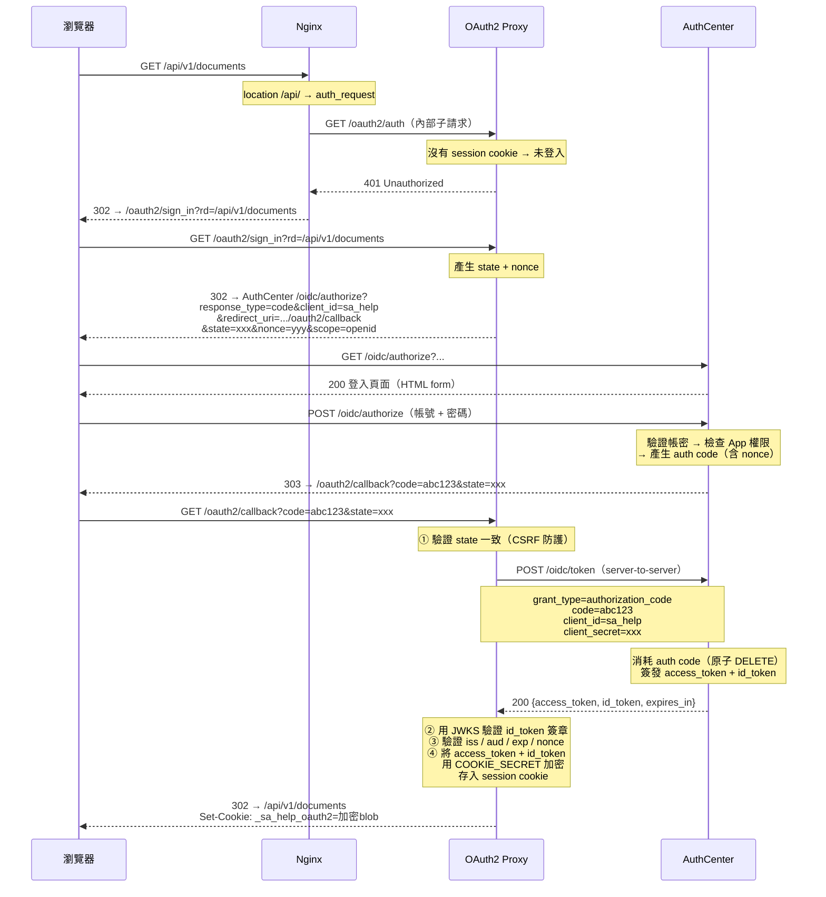
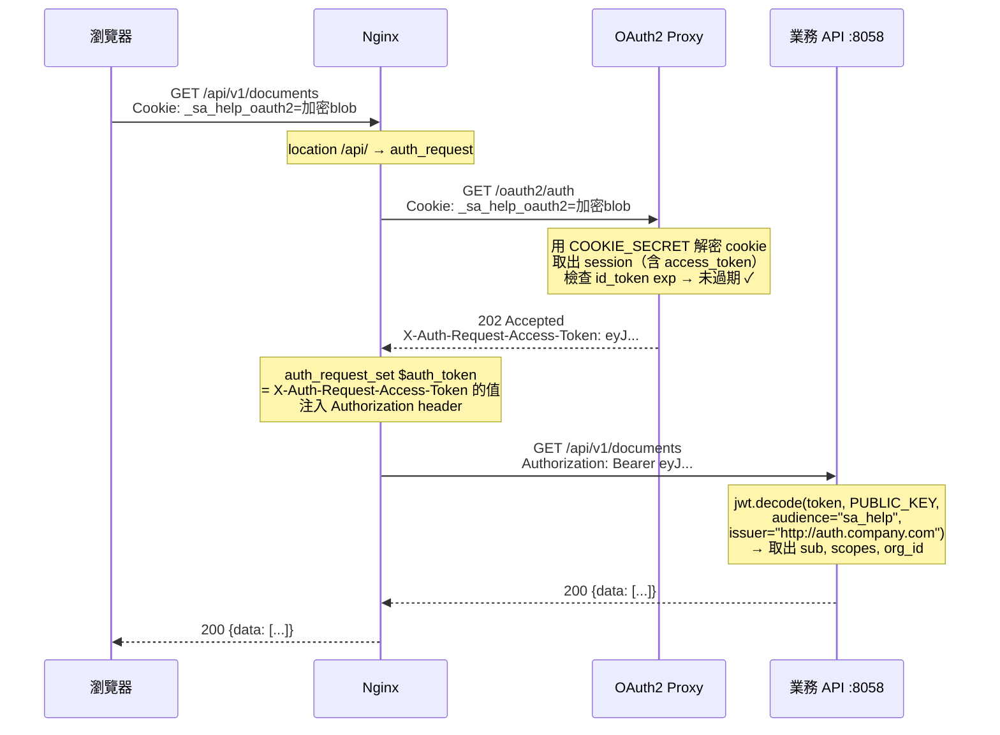
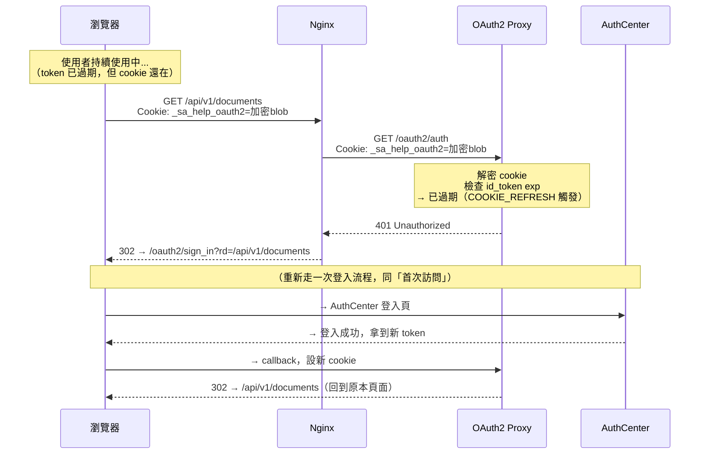
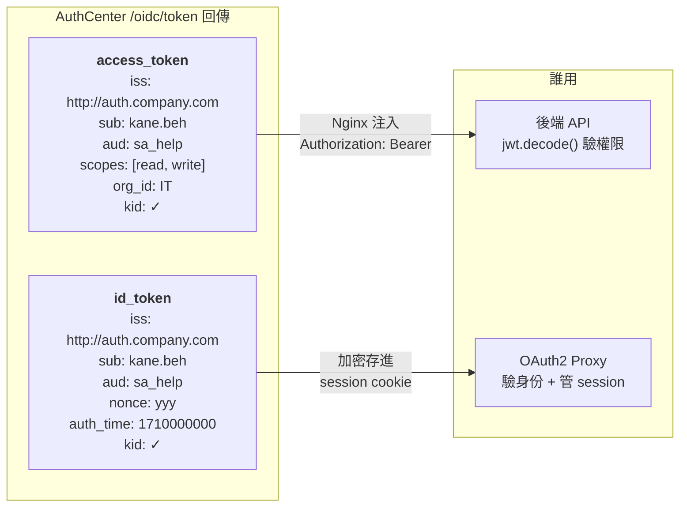

# 全端整合範例 — OAuth2 Proxy + 業務 API + HFS 檔案伺服器

單一域名下整合所有服務，使用 OAuth2 Proxy (auth_request 模式) 統一認證。

## 架構

```
auth.company.com        ← AuthCenter 獨立部署（OIDC Provider）
├── /.well-known/*        OIDC discovery / JWKS
├── /auth/*               登入/註冊/Token
├── /oidc/*               OIDC endpoints
└── /admin/*              管理後台（自帶認證）

sa-help.company.com     ← 業務站台（本範例）
├── /oauth2/*  → OAuth2 Proxy  :4180  （認證判斷）
├── /admin/*   → 業務 API      :8058  （需驗證）管理後台
├── /api/v1/*  → 業務 API      :8058  （需驗證）含檔案上傳 50MB
├── /fs/       → HFS           :8080  （需驗證）檔案伺服器 10GB
└── /          → 前端靜態檔            （需驗證）
```

AuthCenter 和業務站台是**兩個獨立域名**。OAuth2 Proxy 透過 OIDC 協定自動跟 AuthCenter 溝通，業務站台的 Nginx 不需要代理 AuthCenter 的任何端點。

### 流量動線

```
使用者瀏覽器
    │
    ▼
  Nginx (:80/443)  ← sa-help.company.com
    │
    ├── 1. auth_request → OAuth2 Proxy (127.0.0.1:4180)
    │       「這人登入了嗎？」
    │       ├── 202 已登入 → 繼續，並從 response header 取出 access_token
    │       └── 401 未登入 → 302 到 /oauth2/sign_in
    │                         → 302 到 auth.company.com/oidc/authorize（AuthCenter 登入）
    │                         → 登入成功 → 302 回 /oauth2/callback
    │                         → OAuth2 Proxy 用 code 換 token，設定 session cookie
    │
    ├── 2. 認證通過後，Nginx 將 access_token 注入 header：
    │       - /admin/* → Authorization: Bearer <token>   （管理後台，驗 JWT）
    │       - /api/*   → Authorization: Bearer <token>   （後端 API，驗 JWT）
    │       - /fs/*    → X-Auth-Access-Token: <token>    （HFS 不驗 JWT，僅做紀錄）
    │
    └── 3. 轉發到對應後端
            /admin/dashboard      → http://127.0.0.1:8058/admin/dashboard
            /api/v1/documents/xxx → http://127.0.0.1:8058/api/v1/documents/xxx
            /fs/myfile.pdf        → http://127.0.0.1:8080/fs/myfile.pdf  (路徑保留)
```

### 前端不需要處理 Token

```javascript
// 前端直接打 API，不用手動帶 Authorization header
const res = await fetch('/api/v1/documents/list_collection_names');
const data = await res.json();

// 上傳檔案也一樣
const formData = new FormData();
formData.append('file', fileInput.files[0]);
await fetch('/api/v1/documents/upload', { method: 'POST', body: formData });
```

OAuth2 Proxy 的 session cookie 隨請求自動送出 → Nginx auth_request 驗證 → 注入 token → 後端收到 `Authorization: Bearer <token>`。

## 認證流程詳解

### 1. 首次訪問（未登入）

使用者第一次訪問受保護頁面時，會經歷完整的 OIDC 登入流程：



### 2. 後續請求（已登入）

登入後的每次請求，OAuth2 Proxy 只需解密 cookie，不需要再連 AuthCenter：



> **重點**：後續請求完全不經過 AuthCenter。OAuth2 Proxy 只做 cookie 解密 + 過期檢查，效能開銷極低。

### 3. Token 過期與自動重新登入



> `COOKIE_REFRESH: 1h` 表示 OAuth2 Proxy 每小時檢查一次 id_token 的 `exp`。<br/>
> AuthCenter 管理後台設定的 `token_expire_hours`（例如 12h）控制 token 實際壽命。<br/>
> 兩者搭配：token 過期後，最多 1 小時內使用者會被要求重新登入。

### 4. Token 內容對照

兩個 token 同時簽發，用途不同：



## 部署步驟

### 前置條件

- AuthCenter 已部署並可存取（例如 `http://auth.company.com`）
- Nginx 已安裝在 host 上
- Docker + Docker Compose 已安裝

### Step 1: 在 AuthCenter 註冊 App

產生 bcrypt hash：
```bash
python -c "from passlib.hash import bcrypt; print(bcrypt.using(rounds=12).hash('your-secret'))"
```

將 `apps.yaml` 的內容加入 AuthCenter 的 `config/apps.yaml`，替換 `client_secret` 為上面產生的 hash。

**重要**:
- `redirect_uri` 必須指向 `http://sa-help.company.com/oauth2/callback`（OAuth2 Proxy 的 callback，不是後端的）。
- `app_url` 設定為受保護網站的首頁（例如 `http://sa-help.company.com`），讓 AuthCenter Dashboard 的「前往」按鈕能正確導向。

### Step 2: 設定環境變數

```bash
cd examples/full-stack-oauth2-proxy
cp .env.example .env
```

產生 Cookie Secret：
```bash
openssl rand -base64 32 | head -c 32
```

編輯 `.env`，填入：
- `OIDC_ISSUER_URL` — AuthCenter 的對外 URL
- `CLIENT_ID` — 在 apps.yaml 中註冊的 app_id
- `CLIENT_SECRET` — 明文 secret（不是 bcrypt hash）
- `REDIRECT_URL` — `http://sa-help.company.com/oauth2/callback`
- `COOKIE_SECRET` — 上面產生的隨機字串
- `COOKIE_REFRESH` — Cookie 重新驗證間隔（預設 `1h`），讓 token 過期後自動強制重新登入

### Step 3: 啟動 OAuth2 Proxy + HFS

```bash
docker compose up -d
```

確認服務啟動：
```bash
docker compose ps
# 應看到 oauth2-proxy 和 hfs 都是 running
```

### Step 4: 部署前端

**方案 A — Nginx 直接 serve 靜態檔（推薦）：**
```bash
# 將前端 build 產出放到指定目錄
sudo mkdir -p /var/www/sa-help
sudo cp -r dist/* /var/www/sa-help/
```

**方案 B — 前端 dev server（開發用）：**
```bash
# 修改 nginx.conf 的 location / 區塊，改用 proxy_pass
cd your-frontend-project
npm run dev -- --port 3000
```

### Step 5: 設定 Nginx

```bash
# 確認 nginx.conf 主設定有 WebSocket map
# 在 /etc/nginx/nginx.conf 的 http {} 區塊內加入：
#
# map $http_upgrade $connection_upgrade {
#     default upgrade;
#     ''      close;
# }

# 複製設定檔
sudo cp nginx.conf /etc/nginx/sites-available/sa-help.company.com
sudo ln -s /etc/nginx/sites-available/sa-help.company.com /etc/nginx/sites-enabled/

# 測試並重載
sudo nginx -t && sudo systemctl reload nginx
```

### Step 6: 驗證

1. 瀏覽 `http://sa-help.company.com/` → 應導向 AuthCenter 登入頁
2. 登入後 → 看到前端頁面
3. 前端打 `/api/v1/...` → 應正常回應（後端收到 `Authorization: Bearer <token>`）
4. 瀏覽 `/fs/` → 看到 HFS 檔案伺服器（不需再次登入）
5. 在 HFS 上傳/下載大檔案 → 應正常運作

---

## 排查指南

按以下順序逐步排查，從最底層（各服務是否活著）開始往上查。

### 第一步：確認各服務是否活著

```bash
# Docker 容器狀態
docker compose ps
docker compose logs oauth2-proxy --tail 20
docker compose logs hfs --tail 20

# 各 port 是否有在監聽
ss -tlnp | grep -E '4180|8000|8058|8080'
# 應看到:
#   127.0.0.1:4180  ← OAuth2 Proxy
#   0.0.0.0:8000    ← AuthCenter（管理後台 + OIDC Provider）
#   0.0.0.0:8058    ← 業務 API
#   127.0.0.1:8080  ← HFS

# Nginx 狀態
sudo systemctl status nginx
```

### 第二步：確認 AuthCenter OIDC 端點可達

```bash
# 從本機測試能否連到 AuthCenter（用 .env 裡的 OIDC_ISSUER_URL）
curl -s http://auth.company.com/.well-known/openid-configuration | python3 -m json.tool

# 確認回傳的 issuer 與 .env 的 OIDC_ISSUER_URL 完全一致
# 確認 authorization_endpoint, token_endpoint, jwks_uri 都可存取

# JWKS — 應回傳公鑰
curl -s http://auth.company.com/.well-known/jwks.json | python3 -m json.tool
```

### 第三步：確認 OAuth2 Proxy 能連到 AuthCenter

```bash
# 進入容器測試
docker compose exec oauth2-proxy wget -qO- http://auth.company.com/.well-known/openid-configuration

# 如果失敗 → DNS 問題，啟用 docker-compose.yml 的 extra_hosts
# 或改用 IP：
#   OIDC_ISSUER_URL=http://192.168.1.100:8000
```

常見錯誤：
```
# OAuth2 Proxy 日誌如果看到：
# "Unable to fetch provider endpoints" → 無法連到 AuthCenter
# "invalid_client"                     → CLIENT_ID 或 CLIENT_SECRET 不對
# "redirect_uri_mismatch"             → REDIRECT_URL 與 apps.yaml 的 redirect_uri 不一致
```

### 第四步：確認 Nginx auth_request 流程

```bash
# 直接測 OAuth2 Proxy 的 auth 端點
curl -v http://127.0.0.1:4180/oauth2/auth
# 未登入應回 401

# 透過 Nginx 測
curl -v http://sa-help.company.com/
# 未登入應回 302，Location 指向 /oauth2/sign_in?rd=...
```

### 第五步：確認 Token 注入

登入後，在瀏覽器 DevTools 的 Network 面板：

```
1. 隨便打一個 /api/ 請求
2. 看 Request Headers — 應該不會有 Authorization（瀏覽器端不用帶）
3. 在後端日誌看收到的 headers — 應有 Authorization: Bearer <token>
```

後端快速驗證：
```python
# 在業務 API 加一個測試端點
@app.get("/api/debug/headers")
async def debug_headers(request: Request):
    return {
        "authorization": request.headers.get("authorization", "MISSING"),
        "x-auth-user": request.headers.get("x-auth-user", "MISSING"),
    }
```

```bash
# 用瀏覽器登入後，打開新分頁訪問：
# http://sa-help.company.com/api/debug/headers
# 應看到 authorization: "Bearer eyJ..."
```

### 第六步：確認檔案上傳

```bash
# 測試 Nginx 的 client_max_body_size 是否生效
# 建立測試檔案
dd if=/dev/zero of=/tmp/test-10mb.bin bs=1M count=10

# 上傳（需要先登入拿到 cookie）
curl -v -X POST http://sa-help.company.com/api/v1/documents/upload \
  -b "_sa_help_oauth2=<cookie-value>" \
  -F "file=@/tmp/test-10mb.bin"

# 如果回 413 Request Entity Too Large → client_max_body_size 太小
# 如果 timeout → proxy_read_timeout 太短
```

### 第七步：確認 HFS 路徑轉發

```bash
# 直接打 HFS
curl -v http://127.0.0.1:8080/
# 應回 200 + HFS 頁面

# 透過 Nginx（會要求登入）
curl -v http://sa-help.company.com/fs/
# 未登入 → 302 到登入頁
# 已登入 → 200 + HFS /fs/ 資料夾頁面

# 確認路徑保留正確
# 瀏覽器打 /fs/some-folder/ → HFS 應顯示 /fs/some-folder/ 的內容

# 確認無尾部斜線的 redirect
curl -v http://sa-help.company.com/fs
# 應回 301 → Location: /fs/
```

---

## 常見問題

### Q: 為什麼前端不用帶 Authorization header？

因為所有請求都經過同一個域名 (`sa-help.company.com`)，OAuth2 Proxy 的 session cookie 自動隨請求送出。Nginx 的 `auth_request` 驗 cookie → 取出 access_token → 注入 `Authorization` header 給後端。前端完全透明。

### Q: 後端怎麼驗 JWT？

```python
import jwt

OIDC_ISSUER_URL = "http://auth.company.com"  # 與 AuthCenter 的 AUTH_CENTER_BASE_URL 一致

def get_current_user(request: Request):
    auth = request.headers.get("Authorization", "")
    if not auth.startswith("Bearer "):
        raise HTTPException(status_code=401, detail="Missing token")
    token = auth.removeprefix("Bearer ")
    payload = jwt.decode(token, PUBLIC_KEY, algorithms=["RS256"],
                         audience="sa_help", issuer=OIDC_ISSUER_URL)
    return payload
```

`iss` 值等於 AuthCenter 的 `AUTH_CENTER_BASE_URL`。公鑰可從 `{iss}/.well-known/jwks.json` 取得。

### Q: proxy_pass 結尾有沒有 `/` 的差異？

```
# 不帶 / — 路徑原樣保留
location /api/ { proxy_pass http://...:8058; }
/api/v1/docs → http://...:8058/api/v1/docs  ✓

# 帶 / — strip 掉 location 前綴
location /fs/ { proxy_pass http://...:8080/; }
/fs/myfile   → http://...:8080/myfile        ✓
```

業務 API 和 HFS 都用「不帶 /」（路徑原樣保留）。HFS 需要在 VFS 中建立 `/fs` 資料夾來對應 Nginx 的 `/fs/` 路徑前綴，這樣瀏覽器 URL 與 HFS 內部路徑一致，避免 HFS 前端 SPA 路由錯亂。

### Q: 如果有多個業務 API 後端怎麼辦？

```nginx
# 文件服務
location /api/v1/documents/ {
    auth_request /oauth2/auth;
    auth_request_set $auth_token $upstream_http_x_auth_request_access_token;
    proxy_set_header Authorization "Bearer $auth_token";
    proxy_pass http://127.0.0.1:8058;
}

# 使用者服務
location /api/v1/users/ {
    auth_request /oauth2/auth;
    auth_request_set $auth_token $upstream_http_x_auth_request_access_token;
    proxy_set_header Authorization "Bearer $auth_token";
    proxy_pass http://127.0.0.1:8059;
}
```

Nginx 的 location 匹配是最長前綴優先，`/api/v1/documents/` 會優先於 `/api/`。

### Q: Token 過期時間怎麼控制？

AuthCenter 管理後台設定的 `token_expire_hours`（例如 12 小時）控制 JWT 的實際壽命。但 OAuth2 Proxy 的 cookie 預設存活 168 小時（7 天），會比 token 更久。

解法：設定 `OAUTH2_PROXY_COOKIE_REFRESH`（例如 `1h`），讓 OAuth2 Proxy 每小時檢查 id_token 的 `exp` claim。當 JWT 過期後，下一次檢查就會強制重新登入。這樣只要在 AuthCenter 後台調整 `token_expire_hours`，不需要在 client 端同步修改任何設定。

### Q: Cookie 過期後會怎樣？

OAuth2 Proxy 的 session cookie 過期（或 token refresh 檢查發現 JWT 已過期）→ auth_request 回 401 → Nginx 導向登入頁 → 重新走 OIDC flow → 自動拿到新 cookie → 回到原本頁面。使用者只需要重新登入一次。

### Q: AuthCenter Dashboard 的「前往」按鈕怎麼用？

在 AuthCenter 的 apps.yaml 中設定 `app_url`（應用程式首頁網址）：

```yaml
- app_id: "sa_help"
  app_url: "http://sa-help.company.com"  # Dashboard「前往」按鈕的連結目標
  redirect_uri: "http://sa-help.company.com/oauth2/callback"
  # ...
```

Dashboard 會直接連到 `app_url`，OAuth2 Proxy 攔截後自動走 OIDC 流程。

**為什麼不能用 `redirect_uri`？** 因為 Dashboard 的「前往」走的是 `/auth/login`（一般 auth flow），redirect 到 `/oauth2/callback?code=xxx` 時**缺少 `state` 參數**，OAuth2 Proxy 會因為 CSRF 驗證失敗而拒絕。設定 `app_url` 讓 OAuth2 Proxy 自己發起 OIDC flow，就能正確產生和驗證 `state`。

也可以透過 Admin 後台（Super Admin）在 App 設定頁面編輯 App URL。

### Q: 413 Request Entity Too Large

Nginx 預設只允許 1MB body。確認 `client_max_body_size` 有設定在正確的 location 區塊內。

### Q: 502 Bad Gateway

後端服務沒跑起來，或 port 不對。用 `ss -tlnp | grep <port>` 確認。

### Q: OIDC_ISSUER_URL 可以用 Docker 容器名稱（alias）嗎？

**不行。** `OIDC_ISSUER_URL` 有兩個用途：

1. OAuth2 Proxy 用它抓 `/.well-known/openid-configuration`（discovery）
2. 比對 JWT 裡的 `iss` claim 是否一致

AuthCenter 產出的 JWT `iss` 是根據 `AUTH_CENTER_BASE_URL` 設定的（例如 `http://auth.company.com`）。如果 `OIDC_ISSUER_URL` 設成 Docker alias（例如 `http://authcenter:8000`），issuer 比對會失敗：

```
token iss:              "http://auth.company.com"
OIDC_ISSUER_URL:        "http://authcenter:8000"
→ issuer mismatch → 拒絕所有 token ❌
```

**正確做法**：`OIDC_ISSUER_URL` 必須和 `AUTH_CENTER_BASE_URL` 完全一致，用對外域名，然後用 `extra_hosts` 解決容器內 DNS：

```yaml
# docker-compose.yml
oauth2-proxy:
  extra_hosts:
    - "auth.company.com:192.168.1.100"   # AuthCenter 主機的實際 IP
```

如果公司內部 DNS 能正確解析 `auth.company.com`，則不需要 `extra_hosts`。

### Q: OAuth2 Proxy 啟動失敗

```bash
docker compose logs oauth2-proxy
```

常見原因：
- `OIDC_ISSUER_URL` 不可達（容器內 DNS 問題 → 加 `extra_hosts`）
- `COOKIE_SECRET` 為空或長度不對（需 16/24/32 bytes）
- `CLIENT_ID` 在 AuthCenter 的 apps.yaml 中找不到

## 檔案結構

```
full-stack-oauth2-proxy/
├── .env.example         ← 環境變數範本
├── docker-compose.yml   ← OAuth2 Proxy + HFS
├── nginx.conf           ← Nginx 設定（複製到 /etc/nginx/sites-available/）
├── apps.yaml            ← AuthCenter App 註冊範本
└── README.md            ← 本文件
```
